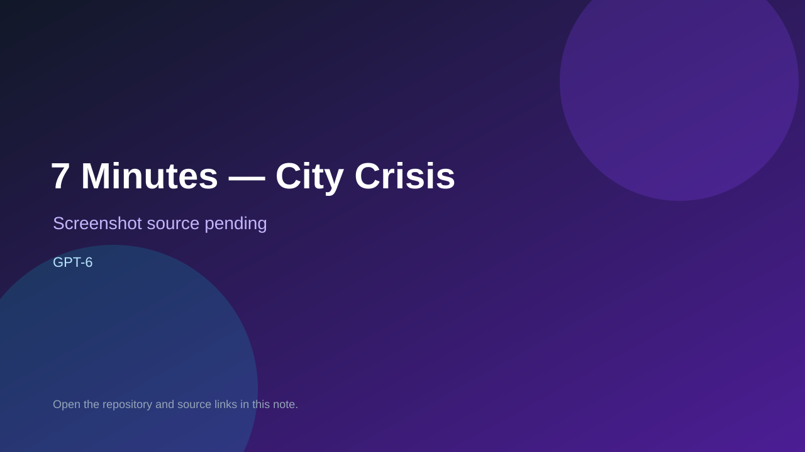

# 7 Minutes — City Crisis

> Verified game note.

## At a glance

- **Score:** 9.3/10
- **Model:** GPT-6
- **Technology:** Three.js, TypeScript, Vite, Web Audio API, LocalStorage, WebGL, Browser
- **Verified:** 2026-09-10
- **Repository:** [https://github.com/hlforever11/gpt6-city-crisis](https://github.com/hlforever11/gpt6-city-crisis)
- **Evidence:** [direct model evidence](https://github.com/hlforever11/gpt6-city-crisis#play)
- **Live demo:** [open demo](https://hlforever11.github.io/gpt6-city-crisis/)

## Screenshots

No screenshot source is recorded yet. Keep the placeholder until a repository, awesome list, or creator source provides an image.

## Model attribution

Open the evidence link above. Evidence grade: **direct model evidence**.

## Source description

The README explicitly identifies a real-time 3D browser strategy game created as a GPT-6 coding capability experiment. It documents a 420-second crisis, eight city systems, limited resources, delayed causal rules, interventions, secondary incidents, score, casualties, replay and local saves. The repository contains a Three.js/Vite implementation, deterministic simulation, audio, WebGL fallback, source tests, Playwright end-to-end tests, 100 seeded runs and a public GitHub Pages build. Browser verification opened the live intro with the seven-minute timer, crisis scenario, Take Control button and local-record state. Count GPT-6 as the qualifying Astra-era model label supplied by the repository.

### Gameplay source

- [https://github.com/hlforever11/gpt6-city-crisis#play](https://github.com/hlforever11/gpt6-city-crisis#play)

## Verification notes

- **Status:** verified
- **Counted units:** 1
- **Discovery:** https://github.com/hlforever11/gpt6-city-crisis; https://api.github.com/search/repositories?q=GPT6+game+in%3Areadme

[Back to the awesome list](../../README.md)
