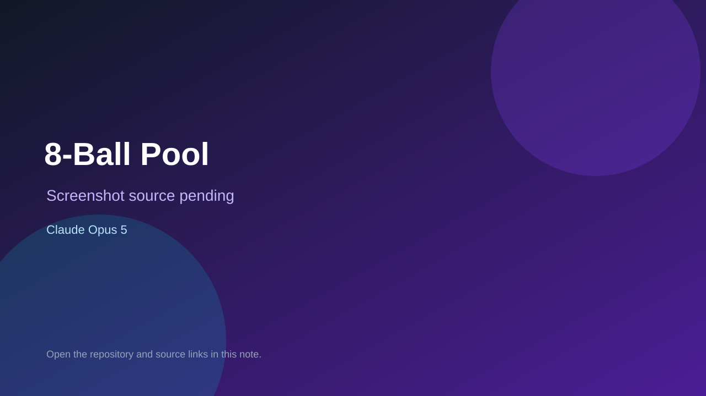

# 8-Ball Pool

> Verified game note.

## At a glance

- **Score:** 9.0/10
- **Model:** Claude Opus 5
- **Technology:** Pygame, Python, Native desktop
- **Verified:** 2026-09-10
- **Repository:** [https://github.com/chrissfoss-nor/8ballpool](https://github.com/chrissfoss-nor/8ballpool)
- **Evidence:** [direct model evidence](https://github.com/chrissfoss-nor/8ballpool/commit/348a6cdeae435000e65b3801a5dd8347471bf98b)

## Screenshots

No screenshot source is recorded yet. Keep the placeholder until a repository, awesome list, or creator source provides an image.

## Model attribution

Open the evidence link above. Evidence grade: **direct model evidence**.

## Source description

The README identifies a local two-player Pygame 8-ball pool game and documents realistic collisions, cue-ball spin, full rules, mouse controls, AI shot search and run commands. The repository contains the Pygame entrypoint, game state/rules/turn systems, table/ball/cue entities, physics engine, renderer, HUD and AI packages. The cited commit includes a direct Claude Opus 5 trailer.

### Gameplay source

- [https://github.com/chrissfoss-nor/8ballpool/blob/348a6cdeae435000e65b3801a5dd8347471bf98b/main.py](https://github.com/chrissfoss-nor/8ballpool/blob/348a6cdeae435000e65b3801a5dd8347471bf98b/main.py)
- [https://github.com/chrissfoss-nor/8ballpool/blob/348a6cdeae435000e65b3801a5dd8347471bf98b/game/game.py](https://github.com/chrissfoss-nor/8ballpool/blob/348a6cdeae435000e65b3801a5dd8347471bf98b/game/game.py)
- [https://github.com/chrissfoss-nor/8ballpool/blob/348a6cdeae435000e65b3801a5dd8347471bf98b/game/rules.py](https://github.com/chrissfoss-nor/8ballpool/blob/348a6cdeae435000e65b3801a5dd8347471bf98b/game/rules.py)
- [https://github.com/chrissfoss-nor/8ballpool/blob/348a6cdeae435000e65b3801a5dd8347471bf98b/physics/engine.py](https://github.com/chrissfoss-nor/8ballpool/blob/348a6cdeae435000e65b3801a5dd8347471bf98b/physics/engine.py)
- [https://github.com/chrissfoss-nor/8ballpool/commit/348a6cdeae435000e65b3801a5dd8347471bf98b](https://github.com/chrissfoss-nor/8ballpool/commit/348a6cdeae435000e65b3801a5dd8347471bf98b)

## Verification notes

- **Status:** verified_source
- **Counted units:** 1
- **Discovery:** GitHub commit search for pygame game Co-Authored-By Claude Opus; https://github.com/chrissfoss-nor/8ballpool

[Back to the awesome list](../../README.md)
