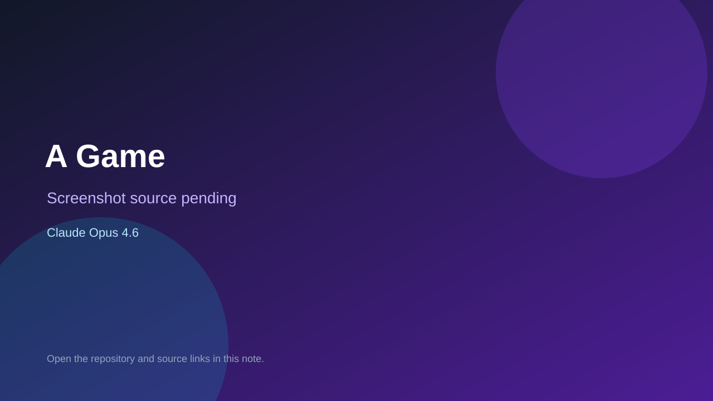

# A Game

> Verified game note.

## At a glance

- **Score:** 6.8/10
- **Model:** Claude Opus 4.6
- **Technology:** Django, Django REST Framework, React, Vite, MariaDB, Browser
- **Verified:** 2026-09-10
- **Repository:** [https://github.com/sfgeekgit/game_e](https://github.com/sfgeekgit/game_e)
- **Evidence:** [direct model evidence](https://github.com/sfgeekgit/game_e#gameplay)
- **Live demo:** [open demo](https://documentbrain.com/agame/)

## Screenshots

No screenshot source is recorded yet. Keep the placeholder until a repository, awesome list, or creator source provides an image.

## Model attribution

Open the evidence link above. Evidence grade: **direct model evidence**.

## Source description

The README documents a live browser clicker game with anonymous accounts, persistent server-side points, button interactions, React/Vite frontend and Django/MariaDB backend. It provides a live URL and explicitly credits Claude Opus 4.6 for the game code, architecture and content.

### Gameplay source

- [https://github.com/sfgeekgit/game_e](https://github.com/sfgeekgit/game_e)
- [https://documentbrain.com/agame/](https://documentbrain.com/agame/)
- [https://github.com/sfgeekgit/game_e#gameplay](https://github.com/sfgeekgit/game_e#gameplay)

## Verification notes

- **Status:** verified_source_and_live_demo
- **Counted units:** 1
- **Discovery:** GitHub repository search: "built with Claude Opus 4.6" game in:readme; https://github.com/sfgeekgit/game_e

[Back to the awesome list](../../README.md)
