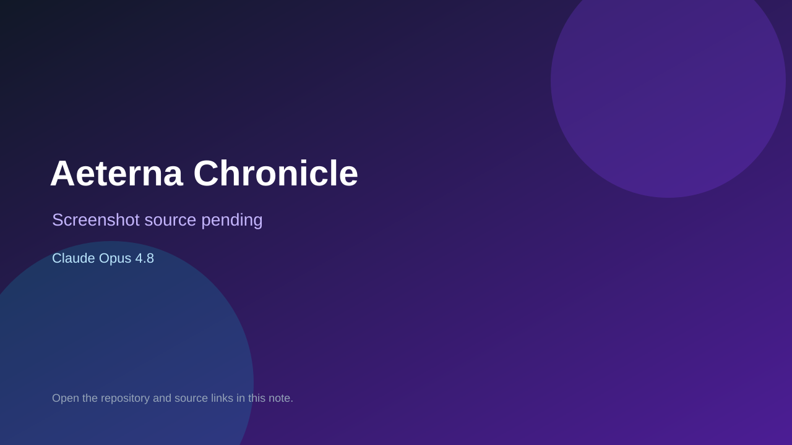

# Aeterna Chronicle

> Top-list entry: **this month** (#17).

## At a glance

- **Score:** 9.4/10
- **Model:** Claude Opus 4.8
- **Technology:** Phaser 3, TypeScript, Vite, Browser
- **Verified:** 2026-09-10
- **Repository:** [https://github.com/crisious/aeterna-chronicle-web](https://github.com/crisious/aeterna-chronicle-web)
- **Evidence:** [direct model evidence](https://github.com/crisious/aeterna-chronicle-web/commit/151985a9d7bfadbb3d0ef1bfab2416ea3a6ce148)

## Screenshots

No screenshot source is recorded yet. Keep the placeholder until a repository, awesome list, or creator source provides an image.

## Model attribution

Open the evidence link above. Evidence grade: **direct model evidence**.

## Source description

The README describes a PC browser real-time semi-automatic ATB RPG built with Phaser, with ten regions, six classes, turn-based combat systems, quests, equipment and multiple endings. WorldScene, BattleScene and CombatManager provide direct exploration and combat implementation. The cited commit includes an exact Co-Authored-By: Claude Opus 4.8 trailer; no public live demo URL was found in the repository documentation.

### Gameplay source

- [https://github.com/crisious/aeterna-chronicle-web/blob/151985a9d7bfadbb3d0ef1bfab2416ea3a6ce148/client/src/main.ts](https://github.com/crisious/aeterna-chronicle-web/blob/151985a9d7bfadbb3d0ef1bfab2416ea3a6ce148/client/src/main.ts)
- [https://github.com/crisious/aeterna-chronicle-web/blob/151985a9d7bfadbb3d0ef1bfab2416ea3a6ce148/client/src/scenes/WorldScene.ts](https://github.com/crisious/aeterna-chronicle-web/blob/151985a9d7bfadbb3d0ef1bfab2416ea3a6ce148/client/src/scenes/WorldScene.ts)
- [https://github.com/crisious/aeterna-chronicle-web/blob/151985a9d7bfadbb3d0ef1bfab2416ea3a6ce148/client/src/scenes/BattleScene.ts](https://github.com/crisious/aeterna-chronicle-web/blob/151985a9d7bfadbb3d0ef1bfab2416ea3a6ce148/client/src/scenes/BattleScene.ts)
- [https://github.com/crisious/aeterna-chronicle-web/blob/151985a9d7bfadbb3d0ef1bfab2416ea3a6ce148/client/src/combat/CombatManager.ts](https://github.com/crisious/aeterna-chronicle-web/blob/151985a9d7bfadbb3d0ef1bfab2416ea3a6ce148/client/src/combat/CombatManager.ts)
- [https://github.com/crisious/aeterna-chronicle-web/commit/151985a9d7bfadbb3d0ef1bfab2416ea3a6ce148](https://github.com/crisious/aeterna-chronicle-web/commit/151985a9d7bfadbb3d0ef1bfab2416ea3a6ce148)

## Verification notes

- **Status:** verified_source
- **Counted units:** 1
- **Discovery:** GitHub code search for Phaser game Co-Authored-By Claude Opus; https://github.com/crisious/aeterna-chronicle-web

[Back to the awesome list](../../README.md)
