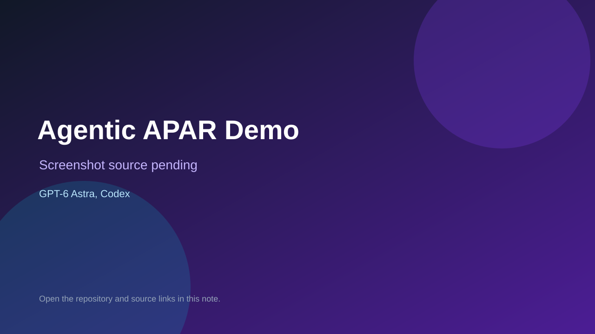

# Agentic APAR Demo

> Verified game note.

## At a glance

- **Score:** 8.7/10
- **Model:** GPT-6 Astra, Codex
- **Technology:** Unity 6.0.6f1, C#, URP 17.6, Unity WebGL, Browser, Windows
- **Verified:** 2026-09-10
- **Repository:** [https://github.com/fathahnoor/AgenticAPARDemo](https://github.com/fathahnoor/AgenticAPARDemo)
- **Evidence:** [direct model evidence](https://github.com/fathahnoor/AgenticAPARDemo#-the-mission)
- **Live demo:** [open demo](https://fathahnoor.github.io/AgenticAPARDemo/)

## Screenshots

No screenshot source is recorded yet. Keep the placeholder until a repository, awesome list, or creator source provides an image.

## Model attribution

Open the evidence link above. Evidence grade: **direct model evidence**.

## Source description

The README documents a Unity 3D fire-extinguisher mission with three fires, a 60-second timer, extinguisher pickup, directional spray, scoring, an exit door and complete/failed states. It explicitly says the WebGL/UX updates were completed with Codex and GPT-6 Astra. The repository contains the Unity scene, C# gameplay scripts, code-built scene builder, tests and Windows/WebGL targets. Browser verification opened the public Unity WebGL build and showed the mission, canvas, loading state and controls. Classified under Browser Games because the WebGL build is public; Windows is an additional runtime.

### Gameplay source

- [https://github.com/fathahnoor/AgenticAPARDemo#-the-mission](https://github.com/fathahnoor/AgenticAPARDemo#-the-mission)

## Verification notes

- **Status:** verified
- **Counted units:** 1
- **Discovery:** https://github.com/fathahnoor/AgenticAPARDemo; https://api.github.com/search/repositories?q=%22GPT-6+Astra%22+Unity+game+in%3Areadme

[Back to the awesome list](../../README.md)
