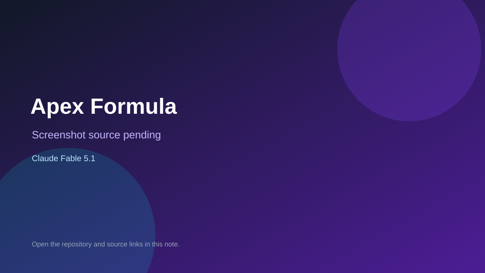

# Apex Formula

> Verified game note.

## At a glance

- **Score:** 8.0/10
- **Model:** Claude Fable 5.1
- **Technology:** Three.js, TypeScript, WebGL
- **Verified:** 2026-09-09
- **Repository:** [https://github.com/bridge-mind/apex-formula](https://github.com/bridge-mind/apex-formula)
- **Evidence:** [direct model evidence](https://github.com/bridge-mind/apex-formula)

## Screenshots

No screenshot source is recorded yet. Keep the placeholder until a repository, awesome list, or creator source provides an image.

## Model attribution

Open the evidence link above. Evidence grade: **direct model evidence**.

## Source description

Full browser Formula 1 game with circuits, AI, physics, race weekend, tests, and explicit Fable 5.1 plus sub-agent attribution.

### Gameplay source

- [https://github.com/bridge-mind/apex-formula](https://github.com/bridge-mind/apex-formula)

## Verification notes

- **Status:** verified
- **Counted units:** 1
- **Discovery:** https://github.com/bridge-mind/apex-formula

[Back to the awesome list](../../README.md)
