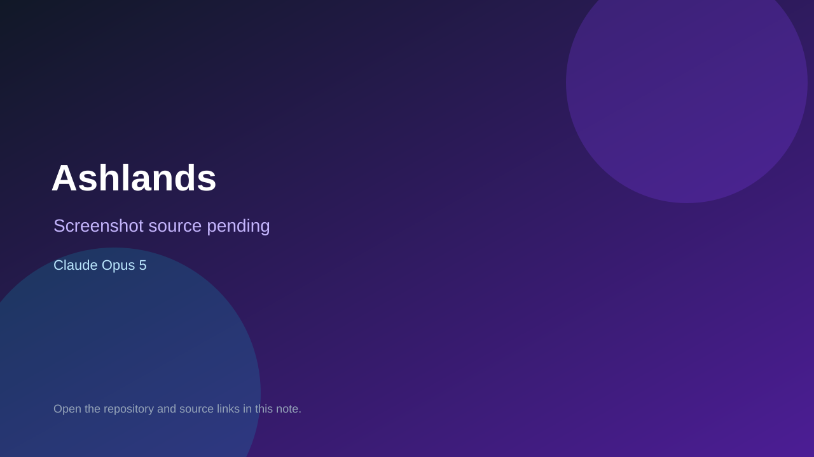

# Ashlands

> Verified game note.

## At a glance

- **Score:** 7.0/10
- **Model:** Claude Opus 5
- **Technology:** Three.js, TypeScript, WebGL2
- **Verified:** 2026-09-09
- **Repository:** [https://github.com/PeterBlenessy/ashlands](https://github.com/PeterBlenessy/ashlands)
- **Evidence:** [directory-method model evidence](https://github.com/PeterBlenessy/ashlands)

## Screenshots

No screenshot source is recorded yet. Keep the placeholder until a repository, awesome list, or creator source provides an image.

## Model attribution

Open the evidence link above. Evidence grade: **directory-method model evidence**.

## Source description

Playable procedural browser action-RPG; README says the entire codebase came from a single Gauntlet Loop prompt and agent verification passes.

### Gameplay source

- [https://github.com/PeterBlenessy/ashlands](https://github.com/PeterBlenessy/ashlands)

## Verification notes

- **Status:** verified
- **Counted units:** 1
- **Discovery:** https://github.com/PeterBlenessy/ashlands

[Back to the awesome list](../../README.md)
