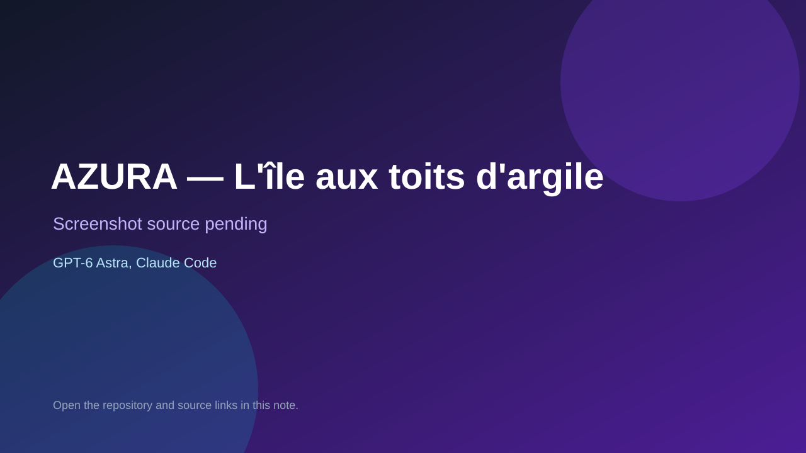

# AZURA — L'île aux toits d'argile

> Verified game note.

## At a glance

- **Score:** 8.7/10
- **Model:** GPT-6 Astra, Claude Code
- **Technology:** WebGL2, HTML, JavaScript, Python build script, Browser
- **Verified:** 2026-09-10
- **Repository:** [https://github.com/Orgxsm/azura](https://github.com/Orgxsm/azura)
- **Evidence:** [direct model evidence](https://github.com/Orgxsm/azura#jouer)
- **Live demo:** [open demo](https://orgxsm.github.io/azura/)

## Screenshots

No screenshot source is recorded yet. Keep the placeholder until a repository, awesome list, or creator source provides an image.

## Model attribution

Open the evidence link above. Evidence grade: **direct model evidence**.

## Source description

The README explicitly describes a one-file 3D exploration game, credits GPT-6 Astra for the island design and Claude Code for the game engine, rendering and quests, and links a GitHub Pages build. The repository contains source modules for game state, quests, dialogue, save state, farming, islands, rendering, shaders, audio, animation and UI. Browser verification opened the live build and showed the playable HUD, quest objective, currency, collectible counters, island map and controls for movement, talking, jumping, running and saving.

### Gameplay source

- [https://github.com/Orgxsm/azura#jouer](https://github.com/Orgxsm/azura#jouer)

## Verification notes

- **Status:** verified
- **Counted units:** 1
- **Discovery:** https://github.com/Orgxsm/azura

[Back to the awesome list](../../README.md)
