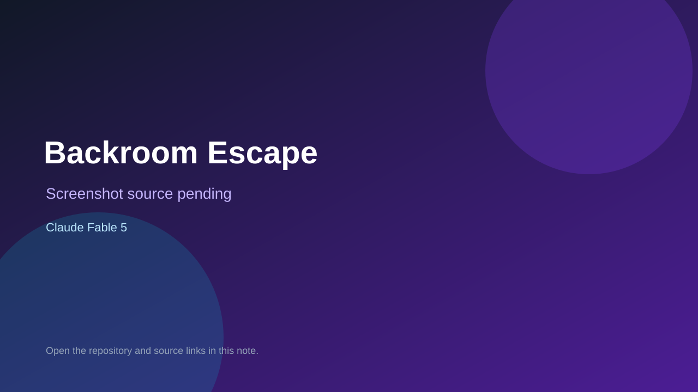

# Backroom Escape

> Verified game note.

## At a glance

- **Score:** 7.5/10
- **Model:** Claude Fable 5
- **Technology:** Three.js, Next.js, JavaScript
- **Verified:** 2026-09-09
- **Repository:** [https://github.com/StarKnightt/Backroom-Escape](https://github.com/StarKnightt/Backroom-Escape)
- **Evidence:** [creator-reported model evidence](https://github.com/StarKnightt/Backroom-Escape)

## Screenshots

No screenshot source is recorded yet. Keep the placeholder until a repository, awesome list, or creator source provides an image.

## Model attribution

Open the evidence link above. Evidence grade: **creator-reported model evidence**.

## Source description

Playable first-person survival-horror game with objectives and controls; repository description explicitly names Three.js and Claude Fable 5.

### Gameplay source

- [https://github.com/StarKnightt/Backroom-Escape](https://github.com/StarKnightt/Backroom-Escape)

## Verification notes

- **Status:** verified
- **Counted units:** 1
- **Discovery:** https://github.com/StarKnightt/Backroom-Escape

[Back to the awesome list](../../README.md)
