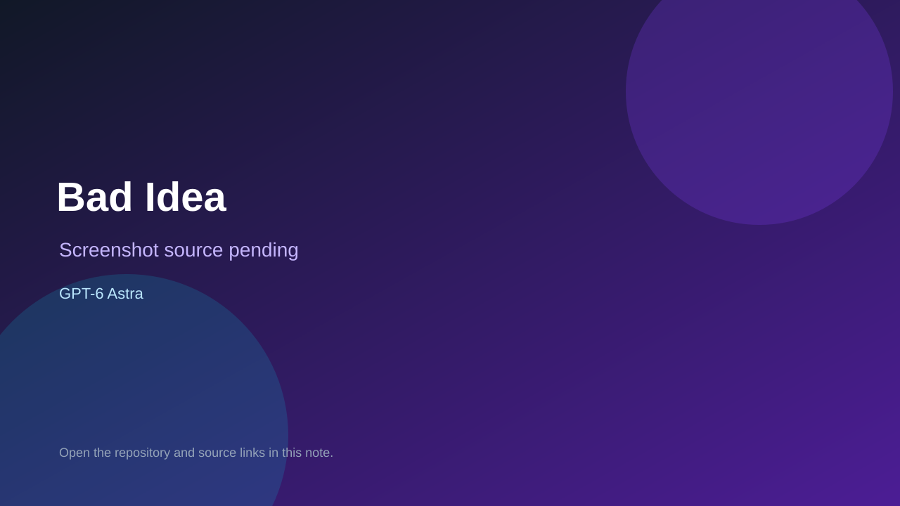

# Bad Idea

> Verified game note.

## At a glance

- **Score:** 8.7/10
- **Model:** GPT-6 Astra
- **Technology:** TypeScript, Three.js, Rapier, Vite, Web browser
- **Verified:** 2026-09-10
- **Repository:** [https://github.com/ToukoUrsin/bad-idea](https://github.com/ToukoUrsin/bad-idea)
- **Evidence:** [direct model evidence](https://github.com/ToukoUrsin/bad-idea#bad-idea)

## Screenshots

No screenshot source is recorded yet. Keep the placeholder until a repository, awesome list, or creator source provides an image.

## Model attribution

Open the evidence link above. Evidence grade: **direct model evidence**.

## Source description

The README explicitly identifies a first-person invention game generated with GPT-6 Astra. It documents a playable loop in which the player escapes changing rooms, invents executable JavaScript objects, carries inventions between rounds, solves adaptive rules and uses movement, physics, inventory, retry and win conditions. The repository contains TypeScript source, Three.js, Rapier, simulation, renderer, room and invention runtimes, starter rooms, launch scripts and test fixtures. The starter rooms remain playable without an API key; adaptive generation needs a configured key. No hosted deployment was found, so classify it under Browser Games without claiming live browser verification.

### Gameplay source

- [https://github.com/ToukoUrsin/bad-idea#bad-idea](https://github.com/ToukoUrsin/bad-idea#bad-idea)

## Verification notes

- **Status:** verified
- **Counted units:** 1
- **Discovery:** https://api.github.com/search/repositories?q=%22GPT-6%22+playable+game+in%3Areadme

[Back to the awesome list](../../README.md)
