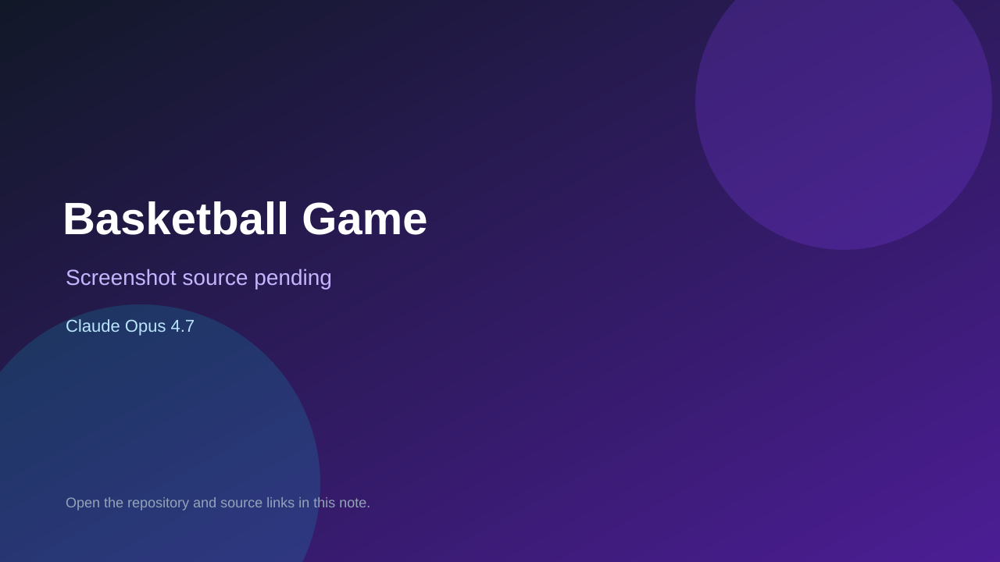

# Basketball Game

> Verified game note.

## At a glance

- **Score:** 7.0/10
- **Model:** Claude Opus 4.7
- **Technology:** Pygame, Python, Native desktop
- **Verified:** 2026-09-10
- **Repository:** [https://github.com/wlssss823/Basketball](https://github.com/wlssss823/Basketball)
- **Evidence:** [direct model evidence](https://github.com/wlssss823/Basketball/commit/14d5e347ae5764e041d2e9342dbd8d4803be908d)

## Screenshots

No screenshot source is recorded yet. Keep the placeholder until a repository, awesome list, or creator source provides an image.

## Model attribution

Open the evidence link above. Evidence grade: **direct model evidence**.

## Source description

The README identifies a Pygame catching game: move left/right, catch falling basketballs for points, lose lives when balls are missed, show game over and track a high score. It gives the `python test_4.py` run command and PyInstaller packaging instructions. The repository contains the game entrypoint and image assets. The initial commit includes a direct Claude Opus 4.7 trailer.

### Gameplay source

- [https://github.com/wlssss823/Basketball/blob/14d5e347ae5764e041d2e9342dbd8d4803be908d/test_4.py](https://github.com/wlssss823/Basketball/blob/14d5e347ae5764e041d2e9342dbd8d4803be908d/test_4.py)
- [https://github.com/wlssss823/Basketball/commit/14d5e347ae5764e041d2e9342dbd8d4803be908d](https://github.com/wlssss823/Basketball/commit/14d5e347ae5764e041d2e9342dbd8d4803be908d)

## Verification notes

- **Status:** verified_source
- **Counted units:** 1
- **Discovery:** GitHub commit search for pygame game Co-Authored-By Claude Opus; https://github.com/wlssss823/Basketball

[Back to the awesome list](../../README.md)
