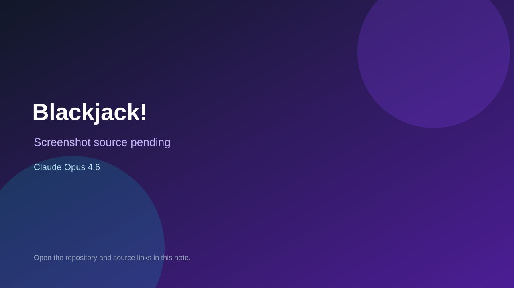

# Blackjack!

> Verified game note.

## At a glance

- **Score:** 8.3/10
- **Model:** Claude Opus 4.6
- **Technology:** Godot 4.6, GDScript, Native
- **Verified:** 2026-09-10
- **Repository:** [https://github.com/kevicency/KumoWare](https://github.com/kevicency/KumoWare)
- **Evidence:** [direct model evidence](https://github.com/kevicency/KumoWare/commit/8a4a86d4537a0a002e63f72f0902abc621aa38c6)

## Screenshots

No screenshot source is recorded yet. Keep the placeholder until a repository, awesome list, or creator source provides an image.

## Model attribution

Open the evidence link above. Evidence grade: **direct model evidence**.

## Source description

The Godot 4.6 repository is a WarioWare-style competitive microgame collection. The cited commit creates Blackjack! and Stack! scenes/scripts and tests. Blackjack has a deck builder, player draw phase, dealer phases, winner determination, card rendering and result state. Stack! has two-player physics arenas, falling boxes, timeout handling, scoring and winner reporting. The commit contains repeated Co-Authored-By: Claude Opus 4.6 trailers. Count both explicitly created microgames and route them to the separate non-browser category.

### Gameplay source

- [https://github.com/kevicency/KumoWare/blob/main/scripts/microgames/blackjack_game.gd](https://github.com/kevicency/KumoWare/blob/main/scripts/microgames/blackjack_game.gd)
- [https://github.com/kevicency/KumoWare/blob/main/scripts/microgames/stack_game.gd](https://github.com/kevicency/KumoWare/blob/main/scripts/microgames/stack_game.gd)
- [https://github.com/kevicency/KumoWare/commit/8a4a86d4537a0a002e63f72f0902abc621aa38c6](https://github.com/kevicency/KumoWare/commit/8a4a86d4537a0a002e63f72f0902abc621aa38c6)

## Verification notes

- **Status:** verified_source
- **Counted units:** 2
- **Discovery:** GitHub commit search for repo:kevicency/KumoWare Co-Authored-By Claude Opus 4.6; https://github.com/kevicency/KumoWare

[Back to the awesome list](../../README.md)
