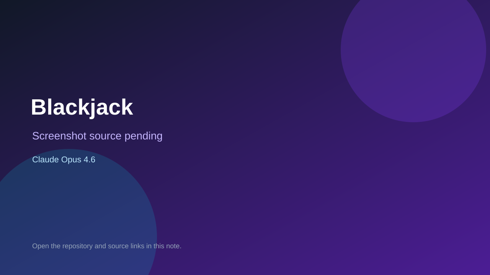

# Blackjack

> Verified game note.

## At a glance

- **Score:** 8.0/10
- **Model:** Claude Opus 4.6
- **Technology:** Next.js, React, JavaScript, Supabase, Browser
- **Verified:** 2026-09-10
- **Repository:** [https://github.com/reytoyogassky/BLACKJACK](https://github.com/reytoyogassky/BLACKJACK)
- **Evidence:** [direct model evidence](https://github.com/reytoyogassky/BLACKJACK/commit/b1450baed5283dc9969877206704e892c540e7eb)

## Screenshots

No screenshot source is recorded yet. Keep the placeholder until a repository, awesome list, or creator source provides an image.

## Model attribution

Open the evidence link above. Evidence grade: **direct model evidence**.

## Source description

The initial public commit is explicitly titled 'Blackjack multiplayer game' and carries a Co-Authored-By: Claude Opus 4.6 trailer. The repository contains a Next.js Blackjack page, multiplayer room routes, game logic, betting, action controls and later betting-phase fixes. A later commit also adds a separate Cekih game, but it is not counted here because the cited initial Opus attribution directly proves Blackjack only.

### Gameplay source

- [https://github.com/reytoyogassky/BLACKJACK/tree/main/app/blackjack](https://github.com/reytoyogassky/BLACKJACK/tree/main/app/blackjack)
- [https://github.com/reytoyogassky/BLACKJACK/commit/b1450baed5283dc9969877206704e892c540e7eb](https://github.com/reytoyogassky/BLACKJACK/commit/b1450baed5283dc9969877206704e892c540e7eb)

## Verification notes

- **Status:** verified_source
- **Counted units:** 1
- **Discovery:** GitHub commit search for Co-Authored-By Claude Opus 4.6; https://github.com/reytoyogassky/BLACKJACK

[Back to the awesome list](../../README.md)
