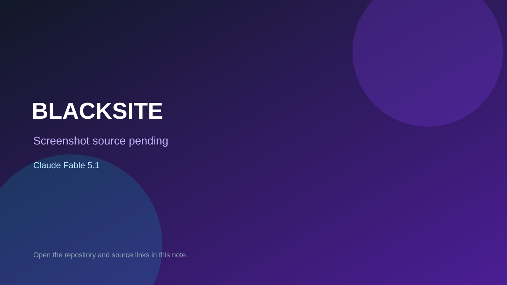

# BLACKSITE

> Verified game note.

## At a glance

- **Score:** 8.5/10
- **Model:** Claude Fable 5.1
- **Technology:** Three.js, TypeScript, Vite, Rapier, WebGL, Browser
- **Verified:** 2026-09-09
- **Repository:** [https://github.com/Hiraeth010/blacksite](https://github.com/Hiraeth010/blacksite)
- **Evidence:** [direct model evidence](https://github.com/Hiraeth010/blacksite)
- **Live demo:** [open demo](https://blacksite-one.vercel.app/)

## Screenshots

No screenshot source is recorded yet. Keep the placeholder until a repository, awesome list, or creator source provides an image.

## Model attribution

Open the evidence link above. Evidence grade: **direct model evidence**.

## Source description

The creator's X post says Claude Fable 5.1 one-shotted this Call of Duty-style game and the follow-up links the repository. GitHub metadata and source confirm a substantial Three.js wave-survival FPS with procedural assets, Rapier physics, TypeScript/Vite source, a public Vercel deployment, waves, enemies, weapons, scoring, killstreaks, difficulty and restart state. Browser verification started the live demo and reached Wave 01 with an M4A1, hostiles inbound, objective, health, ammunition and score HUD.

### Gameplay source

- [https://github.com/Hiraeth010/blacksite](https://github.com/Hiraeth010/blacksite)

## Verification notes

- **Status:** verified
- **Counted units:** 1
- **Discovery:** https://x.com/WoahWurdz/status/2094971419977269476; https://x.com/WoahWurdz/status/2094971737028931954; https://github.com/Hiraeth010/blacksite

[Back to the awesome list](../../README.md)
