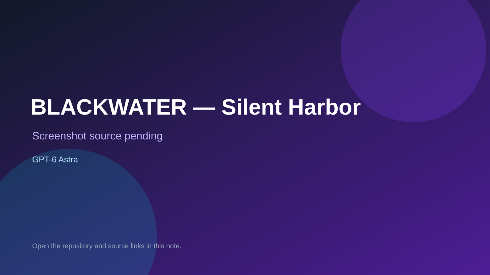

# BLACKWATER — Silent Harbor

> Verified game note.

## At a glance

- **Score:** 8.5/10
- **Model:** GPT-6 Astra
- **Technology:** Three.js, React, TypeScript, WebGL, Vite, Browser
- **Verified:** 2026-09-09
- **Repository:** [https://github.com/Hiraeth010/blackwater](https://github.com/Hiraeth010/blackwater)
- **Evidence:** [direct model evidence](https://github.com/Hiraeth010/blackwater/blob/main/README.md)
- **Live demo:** [open demo](https://blackwater-roan.vercel.app/)

## Screenshots

No screenshot source is recorded yet. Keep the placeholder until a repository, awesome list, or creator source provides an image.

## Model attribution

Open the evidence link above. Evidence grade: **direct model evidence**.

## Source description

The creator's X post explicitly says GPT-6 Astra one-shotted the Call of Duty-style game and the follow-up post links the source repository. GitHub verification confirms a complete Three.js/React/TypeScript tactical FPS with procedural environment and assets, nine hostiles, weapons, cover-aware enemy navigation, extraction, death/restart, synthesized audio, a live Vercel demo, source modules and automated combat/world tests.

### Gameplay source

- [https://github.com/Hiraeth010/blackwater/blob/main/README.md](https://github.com/Hiraeth010/blackwater/blob/main/README.md)

## Verification notes

- **Status:** verified
- **Counted units:** 1
- **Discovery:** https://github.com/MartinDelophy/awesome-gpt-6-astra; https://x.com/WoahWurdz/status/2095958882732355908; https://x.com/WoahWurdz/status/2095959107215798447; https://github.com/Hiraeth010/blackwater

[Back to the awesome list](../../README.md)
