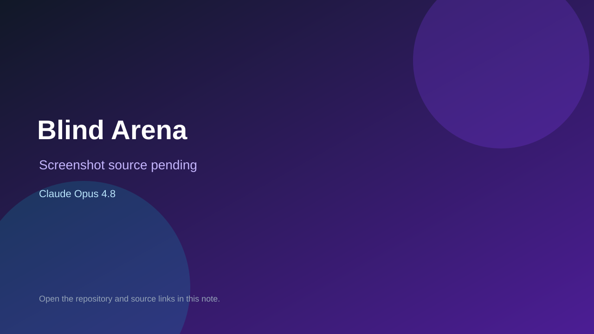

# Blind Arena

> Verified game note.

## At a glance

- **Score:** 8.6/10
- **Model:** Claude Opus 4.8
- **Technology:** Unity, C#, Native
- **Verified:** 2026-09-10
- **Repository:** [https://github.com/Ares2023/BlindArena](https://github.com/Ares2023/BlindArena)
- **Evidence:** [direct model evidence](https://github.com/Ares2023/BlindArena/commit/e7d142a73556e41063afb69f63a6f3fb9b69deeb)

## Screenshots

No screenshot source is recorded yet. Keep the placeholder until a repository, awesome list, or creator source provides an image.

## Model attribution

Open the evidence link above. Evidence grade: **direct model evidence**.

## Source description

The repository contains a Unity Main.unity scene, player controller, combatant, bullets, ammo, enemy AI, map generation, network session/player scripts, tutorial flow, announcer and audio-first WebGL TTS integration. The initial commit is titled Blind Arena, an audio-first 2D versus game, and carries a direct Co-Authored-By: Claude Opus 4.8 trailer.

### Gameplay source

- [https://github.com/Ares2023/BlindArena/blob/main/Assets/Scenes/Main.unity](https://github.com/Ares2023/BlindArena/blob/main/Assets/Scenes/Main.unity)
- [https://github.com/Ares2023/BlindArena/tree/main/Assets/Scripts](https://github.com/Ares2023/BlindArena/tree/main/Assets/Scripts)
- [https://github.com/Ares2023/BlindArena/commit/e7d142a73556e41063afb69f63a6f3fb9b69deeb](https://github.com/Ares2023/BlindArena/commit/e7d142a73556e41063afb69f63a6f3fb9b69deeb)

## Verification notes

- **Status:** verified_source
- **Counted units:** 1
- **Discovery:** GitHub commit search for Unity game Co-Authored-By Claude Opus; https://github.com/Ares2023/BlindArena

[Back to the awesome list](../../README.md)
