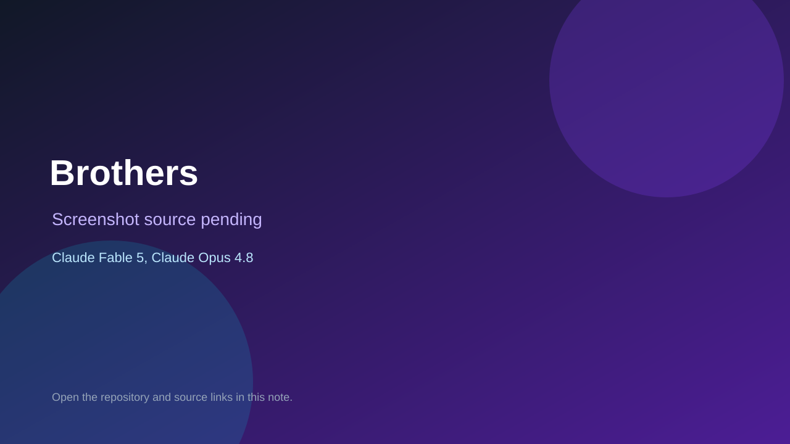

# Brothers

> Verified game note.

## At a glance

- **Score:** 9.3/10
- **Model:** Claude Fable 5, Claude Opus 4.8
- **Technology:** Phaser 3, Matter.js, JavaScript, Web Audio API, Browser
- **Verified:** 2026-09-10
- **Repository:** [https://github.com/david-a-wheeler/brothers](https://github.com/david-a-wheeler/brothers)
- **Evidence:** [direct model evidence](https://github.com/david-a-wheeler/brothers/commit/2a545f4a75b06edcbcd8873d3f5dfbfbcc5188dd)
- **Live demo:** [open demo](https://brothers.dwheeler.com/)

## Screenshots

No screenshot source is recorded yet. Keep the placeholder until a repository, awesome list, or creator source provides an image.

## Model attribution

Open the evidence link above. Evidence grade: **direct model evidence**.

## Source description

The README describes a playable browser puzzle game in which two tethered brothers are flung across arenas to reach goals, with walls, teleporters, zoom, pan and Tiled levels. GameScene and the world classes implement the launch physics and objectives; the live URL returned HTTP 200. The cited refactor commit includes an exact Co-Authored-By: Claude Fable 5 trailer, and nearby gameplay commits include Claude Opus 4.8 trailers.

### Gameplay source

- [https://github.com/david-a-wheeler/brothers/blob/2a545f4a75b06edcbcd8873d3f5dfbfbcc5188dd/src/main.js](https://github.com/david-a-wheeler/brothers/blob/2a545f4a75b06edcbcd8873d3f5dfbfbcc5188dd/src/main.js)
- [https://github.com/david-a-wheeler/brothers/blob/2a545f4a75b06edcbcd8873d3f5dfbfbcc5188dd/src/scenes/GameScene.js](https://github.com/david-a-wheeler/brothers/blob/2a545f4a75b06edcbcd8873d3f5dfbfbcc5188dd/src/scenes/GameScene.js)
- [https://github.com/david-a-wheeler/brothers/blob/2a545f4a75b06edcbcd8873d3f5dfbfbcc5188dd/src/world/Brother.js](https://github.com/david-a-wheeler/brothers/blob/2a545f4a75b06edcbcd8873d3f5dfbfbcc5188dd/src/world/Brother.js)
- [https://github.com/david-a-wheeler/brothers/blob/2a545f4a75b06edcbcd8873d3f5dfbfbcc5188dd/packs/Base/level1.tmj](https://github.com/david-a-wheeler/brothers/blob/2a545f4a75b06edcbcd8873d3f5dfbfbcc5188dd/packs/Base/level1.tmj)
- [https://github.com/david-a-wheeler/brothers/commit/2a545f4a75b06edcbcd8873d3f5dfbfbcc5188dd](https://github.com/david-a-wheeler/brothers/commit/2a545f4a75b06edcbcd8873d3f5dfbfbcc5188dd)

## Verification notes

- **Status:** verified_source
- **Counted units:** 1
- **Discovery:** GitHub code search for Phaser game Co-Authored-By Claude Opus; https://github.com/david-a-wheeler/brothers

[Back to the awesome list](../../README.md)
