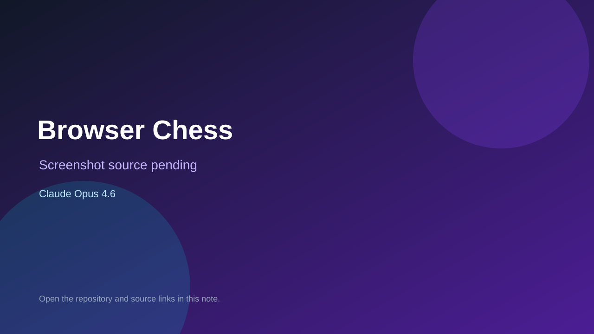

# Browser Chess

> Verified game note.

## At a glance

- **Score:** 8.1/10
- **Model:** Claude Opus 4.6
- **Technology:** React, Vite, JavaScript, Browser
- **Verified:** 2026-09-10
- **Repository:** [https://github.com/jaimec00/chess-game](https://github.com/jaimec00/chess-game)
- **Evidence:** [direct model evidence](https://github.com/jaimec00/chess-game/commit/b3a556f744e1a0ee4acdc50f382c0b17b87f0784)

## Screenshots

No screenshot source is recorded yet. Keep the placeholder until a repository, awesome list, or creator source provides an image.

## Model attribution

Open the evidence link above. Evidence grade: **direct model evidence**.

## Source description

The repository description identifies a browser chess game with React and Vite. The cited commit adds an LLM API game mode and a 306-line ApiGame component, with chess board interaction and retry logic, and carries multiple Co-Authored-By: Claude Opus 4.6 trailers. Count it as source-verified because no stable public demo was found.

### Gameplay source

- [https://github.com/jaimec00/chess-game/tree/main/src](https://github.com/jaimec00/chess-game/tree/main/src)
- [https://github.com/jaimec00/chess-game/commit/b3a556f744e1a0ee4acdc50f382c0b17b87f0784](https://github.com/jaimec00/chess-game/commit/b3a556f744e1a0ee4acdc50f382c0b17b87f0784)

## Verification notes

- **Status:** verified_source
- **Counted units:** 1
- **Discovery:** GitHub commit search for game Co-Authored-By Claude Opus 4.6; https://github.com/jaimec00/chess-game

[Back to the awesome list](../../README.md)
