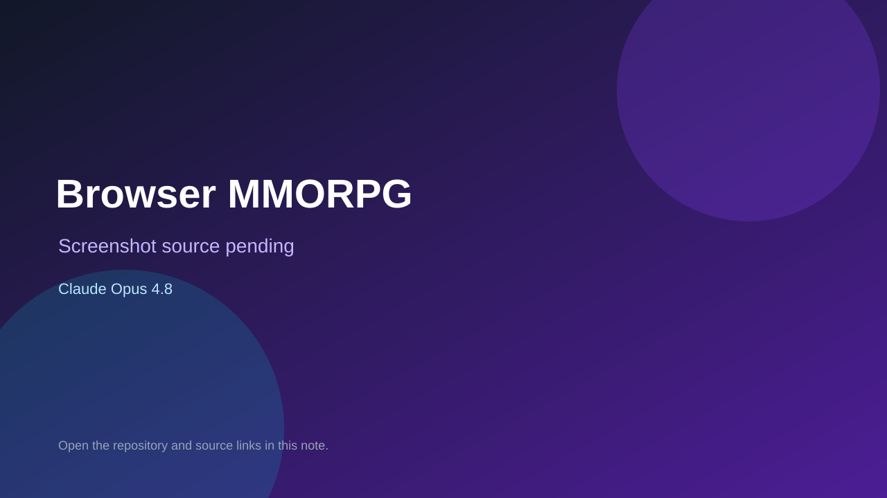

# Browser MMORPG

> Verified game note.

## At a glance

- **Score:** 8.9/10
- **Model:** Claude Opus 4.8
- **Technology:** Phaser 3, TypeScript, Vite, Colyseus, PostgreSQL, Redis, Browser
- **Verified:** 2026-09-10
- **Repository:** [https://github.com/luknet/browser-mmorpg](https://github.com/luknet/browser-mmorpg)
- **Evidence:** [direct model evidence](https://github.com/luknet/browser-mmorpg/commit/dc97d336072d1c0c867a40912b340bae436ea181)

## Screenshots

No screenshot source is recorded yet. Keep the placeholder until a repository, awesome list, or creator source provides an image.

## Model attribution

Open the evidence link above. Evidence grade: **direct model evidence**.

## Source description

The repository description identifies a browser MMORPG with a Phaser 3 client and authoritative Colyseus server. ZoneScene and EntityLayer implement the playable client world, while ZoneRoom provides authoritative room state; the repository includes characters, items, movement, HUD, quests and persistence plans. The cited commit includes an exact Co-Authored-By: Claude Opus 4.8 trailer. No public live demo URL was found in the repository metadata.

### Gameplay source

- [https://github.com/luknet/browser-mmorpg/blob/dc97d336072d1c0c867a40912b340bae436ea181/packages/client/src/main.ts](https://github.com/luknet/browser-mmorpg/blob/dc97d336072d1c0c867a40912b340bae436ea181/packages/client/src/main.ts)
- [https://github.com/luknet/browser-mmorpg/blob/dc97d336072d1c0c867a40912b340bae436ea181/packages/client/src/scenes/ZoneScene.ts](https://github.com/luknet/browser-mmorpg/blob/dc97d336072d1c0c867a40912b340bae436ea181/packages/client/src/scenes/ZoneScene.ts)
- [https://github.com/luknet/browser-mmorpg/blob/dc97d336072d1c0c867a40912b340bae436ea181/packages/client/src/entities/EntityLayer.ts](https://github.com/luknet/browser-mmorpg/blob/dc97d336072d1c0c867a40912b340bae436ea181/packages/client/src/entities/EntityLayer.ts)
- [https://github.com/luknet/browser-mmorpg/blob/dc97d336072d1c0c867a40912b340bae436ea181/packages/server/src/rooms/ZoneRoom.ts](https://github.com/luknet/browser-mmorpg/blob/dc97d336072d1c0c867a40912b340bae436ea181/packages/server/src/rooms/ZoneRoom.ts)
- [https://github.com/luknet/browser-mmorpg/commit/dc97d336072d1c0c867a40912b340bae436ea181](https://github.com/luknet/browser-mmorpg/commit/dc97d336072d1c0c867a40912b340bae436ea181)

## Verification notes

- **Status:** verified_source
- **Counted units:** 1
- **Discovery:** GitHub code search for Phaser game Co-Authored-By Claude Opus; https://github.com/luknet/browser-mmorpg

[Back to the awesome list](../../README.md)
