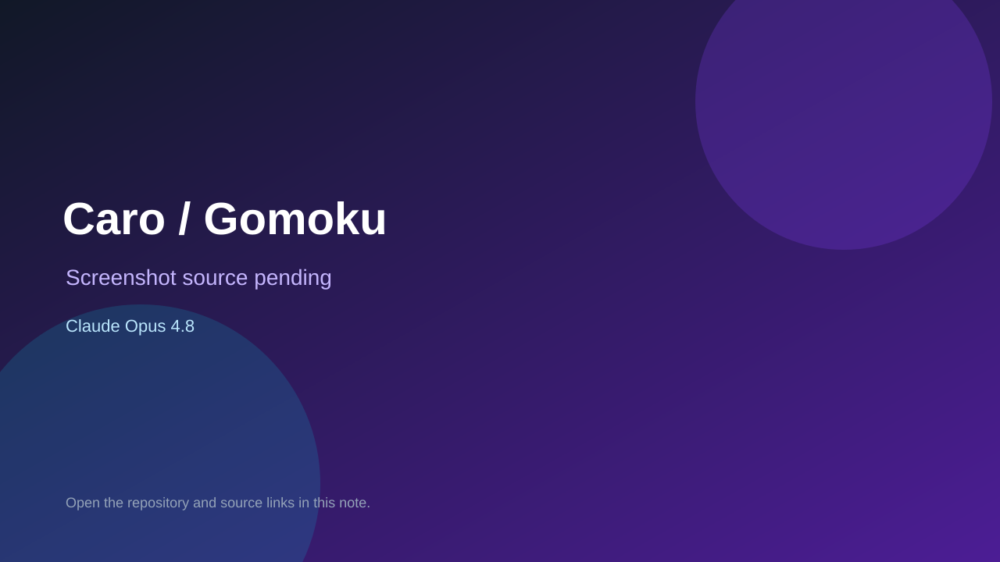

# Caro / Gomoku

> Verified game note.

## At a glance

- **Score:** 7.9/10
- **Model:** Claude Opus 4.8
- **Technology:** raylib, C++14, Native desktop
- **Verified:** 2026-09-10
- **Repository:** [https://github.com/nhannht/caro-game](https://github.com/nhannht/caro-game)
- **Evidence:** [direct model evidence](https://github.com/nhannht/caro-game/commit/f8e79aa58a2ceab3a37b21ccf1422cacf875fa90)

## Screenshots

No screenshot source is recorded yet. Keep the placeholder until a repository, awesome list, or creator source provides an image.

## Model attribution

Open the evidence link above. Evidence grade: **direct model evidence**.

## Source description

The README identifies a C++14 Caro/Gomoku game built with Raylib for an OOP class. The committed project has CMake configuration, a Raylib C++ main implementation and a large AI/game source commit. The cited commit page shows a direct Claude Opus 4.8 trailer.

### Gameplay source

- [https://github.com/nhannht/caro-game/blob/master/README.md](https://github.com/nhannht/caro-game/blob/master/README.md)
- [https://github.com/nhannht/caro-game/blob/master/src/main.cpp](https://github.com/nhannht/caro-game/blob/master/src/main.cpp)
- [https://github.com/nhannht/caro-game/blob/master/CMakeLists.txt](https://github.com/nhannht/caro-game/blob/master/CMakeLists.txt)
- [https://github.com/nhannht/caro-game/commit/f8e79aa58a2ceab3a37b21ccf1422cacf875fa90](https://github.com/nhannht/caro-game/commit/f8e79aa58a2ceab3a37b21ccf1422cacf875fa90)

## Verification notes

- **Status:** verified_source
- **Counted units:** 1
- **Discovery:** GitHub commit search for raylib game Co-Authored-By Claude Opus; https://github.com/nhannht/caro-game

[Back to the awesome list](../../README.md)
