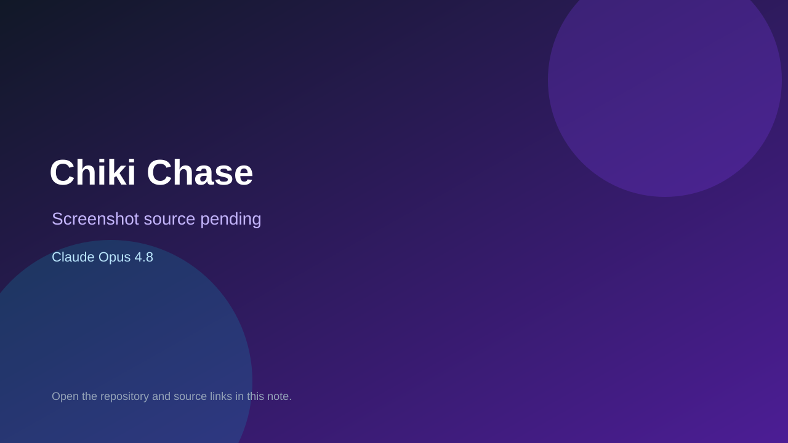

# Chiki Chase

> Verified game note.

## At a glance

- **Score:** 7.8/10
- **Model:** Claude Opus 4.8
- **Technology:** Pygame, Python, Native desktop
- **Verified:** 2026-09-10
- **Repository:** [https://github.com/tzelynn/chikichase](https://github.com/tzelynn/chikichase)
- **Evidence:** [direct model evidence](https://github.com/tzelynn/chikichase/commit/41133644497c51e423da47d0a3adff68f652e9db)

## Screenshots

No screenshot source is recorded yet. Keep the placeholder until a repository, awesome list, or creator source provides an image.

## Model attribution

Open the evidence link above. Evidence grade: **direct model evidence**.

## Source description

The cited commit is titled commit game assets, original pygame source, and lockfile. It includes pygame_corn_chase.py, game assets and web-runtime support. The commit page shows a direct Claude Opus 4.8 trailer.

### Gameplay source

- [https://github.com/tzelynn/chikichase/blob/main/ancient_ref/pygame_chiki_chase.py](https://github.com/tzelynn/chikichase/blob/main/ancient_ref/pygame_chiki_chase.py)
- [https://github.com/tzelynn/chikichase](https://github.com/tzelynn/chikichase)
- [https://github.com/tzelynn/chikichase/commit/41133644497c51e423da47d0a3adff68f652e9db](https://github.com/tzelynn/chikichase/commit/41133644497c51e423da47d0a3adff68f652e9db)

## Verification notes

- **Status:** verified_source
- **Counted units:** 1
- **Discovery:** GitHub commit search for Pygame game Co-Authored-By Claude Opus; https://github.com/tzelynn/chikichase

[Back to the awesome list](../../README.md)
