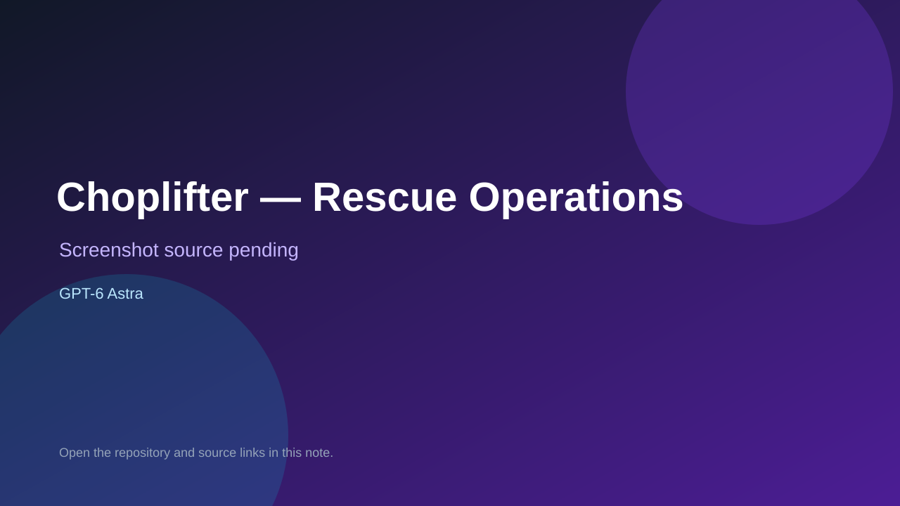

# Choplifter — Rescue Operations

> Verified game note.

## At a glance

- **Score:** 8.8/10
- **Model:** GPT-6 Astra
- **Technology:** JavaScript, Phaser, HTML/CSS, Canvas, Browser
- **Verified:** 2026-09-10
- **Repository:** [https://github.com/danielpradilla/choplifter](https://github.com/danielpradilla/choplifter)
- **Evidence:** [direct model evidence](https://github.com/danielpradilla/choplifter#choplifter-one-shotted)

## Screenshots

No screenshot source is recorded yet. Keep the placeholder until a repository, awesome list, or creator source provides an image.

## Model attribution

Open the evidence link above. Evidence grade: **direct model evidence**.

## Source description

The repository preserves four browser-game attempts from one Choplifter brief. Count only the dedicated GPT-6 Astra directory, which contains index.html, package metadata, source game and mission files, a build path and the public Rescue Operations demo. The README documents a complete helicopter loop: fly, free 64 hostages, land nearby, load up to 16 people and return east to the home pad. The live demo opened its pilot briefing, mission objectives, rescue counters, control instructions and START MISSION button. Exclude the GPT-5.3 Codex, GPT-5.4 and GPT-5.6 Sol variants from the Astra count.

### Gameplay source

- [https://github.com/danielpradilla/choplifter/tree/main/choplifter-6-astra](https://github.com/danielpradilla/choplifter/tree/main/choplifter-6-astra)
- [https://github.com/danielpradilla/choplifter#choplifter-one-shotted](https://github.com/danielpradilla/choplifter#choplifter-one-shotted)

## Verification notes

- **Status:** verified
- **Counted units:** 1
- **Discovery:** https://api.github.com/search/repositories?q=%22GPT-6+Astra%22+game+in%3Areadme; https://github.com/BeatAPI/awesome-3d-prompts

[Back to the awesome list](../../README.md)
