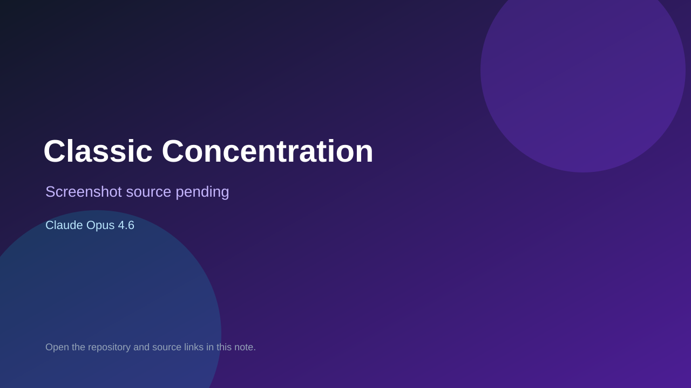

# Classic Concentration

> Verified game note.

## At a glance

- **Score:** 8.4/10
- **Model:** Claude Opus 4.6
- **Technology:** Unity 6, C#, Native mobile
- **Verified:** 2026-09-10
- **Repository:** [https://github.com/luvcal1/classic-concentration](https://github.com/luvcal1/classic-concentration)
- **Evidence:** [direct model evidence](https://github.com/luvcal1/classic-concentration/commit/666c1de132e375501949741bc15c73cf10299f3d)

## Screenshots

No screenshot source is recorded yet. Keep the placeholder until a repository, awesome list, or creator source provides an image.

## Model attribution

Open the evidence link above. Evidence grade: **direct model evidence**.

## Source description

The initial commit is titled Classic Concentration mobile game for Unity 6. It contains MainMenu and GameScene scenes, board manager, panel/card logic, game manager/state, puzzle database/rebus puzzle scripts, prize data, audio manager and solve UI. The commit page shows a direct Co-Authored-By: Claude Opus 4.6 trailer.

### Gameplay source

- [https://github.com/luvcal1/classic-concentration/tree/main/Assets/Scenes](https://github.com/luvcal1/classic-concentration/tree/main/Assets/Scenes)
- [https://github.com/luvcal1/classic-concentration/tree/main/Assets/Scripts](https://github.com/luvcal1/classic-concentration/tree/main/Assets/Scripts)
- [https://github.com/luvcal1/classic-concentration/commit/666c1de132e375501949741bc15c73cf10299f3d](https://github.com/luvcal1/classic-concentration/commit/666c1de132e375501949741bc15c73cf10299f3d)

## Verification notes

- **Status:** verified_source
- **Counted units:** 1
- **Discovery:** GitHub commit search for Unity game Co-Authored-By Claude Opus 4.6; https://github.com/luvcal1/classic-concentration

[Back to the awesome list](../../README.md)
