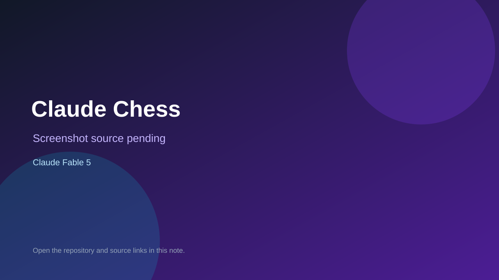

# Claude Chess

> Verified game note.

## At a glance

- **Score:** 9.2/10
- **Model:** Claude Fable 5
- **Technology:** Vanilla JavaScript, chess.js, Stockfish 17.1 WebAssembly, Vite, Browser
- **Verified:** 2026-09-10
- **Repository:** [https://github.com/mglass222/claude-chess-web](https://github.com/mglass222/claude-chess-web)
- **Evidence:** [direct model evidence](https://github.com/mglass222/claude-chess-web/commit/debca7b29bfc289813c111866bcf07f157430819)
- **Live demo:** [open demo](https://mglass222.github.io/claude-chess-web/)

## Screenshots

No screenshot source is recorded yet. Keep the placeholder until a repository, awesome list, or creator source provides an image.

## Model attribution

Open the evidence link above. Evidence grade: **direct model evidence**.

## Source description

The README describes a complete browser chess game with Stockfish opponents, eight strengths, clocks, legal-move interaction, evaluation bar, post-game analysis, replay navigation, save/load and sound. GameController and GameState implement play state, EngineManager integrates Stockfish and BoardView renders the board; the live GitHub Pages build returned HTTP 200. The cited commit includes an exact Co-Authored-By: Claude Fable 5 trailer.

### Gameplay source

- [https://github.com/mglass222/claude-chess-web/blob/debca7b29bfc289813c111866bcf07f157430819/src/main.js](https://github.com/mglass222/claude-chess-web/blob/debca7b29bfc289813c111866bcf07f157430819/src/main.js)
- [https://github.com/mglass222/claude-chess-web/blob/debca7b29bfc289813c111866bcf07f157430819/src/game/GameController.js](https://github.com/mglass222/claude-chess-web/blob/debca7b29bfc289813c111866bcf07f157430819/src/game/GameController.js)
- [https://github.com/mglass222/claude-chess-web/blob/debca7b29bfc289813c111866bcf07f157430819/src/game/GameState.js](https://github.com/mglass222/claude-chess-web/blob/debca7b29bfc289813c111866bcf07f157430819/src/game/GameState.js)
- [https://github.com/mglass222/claude-chess-web/blob/debca7b29bfc289813c111866bcf07f157430819/src/engine/EngineManager.js](https://github.com/mglass222/claude-chess-web/blob/debca7b29bfc289813c111866bcf07f157430819/src/engine/EngineManager.js)
- [https://github.com/mglass222/claude-chess-web/blob/debca7b29bfc289813c111866bcf07f157430819/src/ui/BoardView.js](https://github.com/mglass222/claude-chess-web/blob/debca7b29bfc289813c111866bcf07f157430819/src/ui/BoardView.js)
- [https://github.com/mglass222/claude-chess-web/commit/debca7b29bfc289813c111866bcf07f157430819](https://github.com/mglass222/claude-chess-web/commit/debca7b29bfc289813c111866bcf07f157430819)

## Verification notes

- **Status:** verified_source
- **Counted units:** 1
- **Discovery:** GitHub code search for C++ game Co-Authored-By Claude Opus; https://github.com/mglass222/claude-chess-web

[Back to the awesome list](../../README.md)
