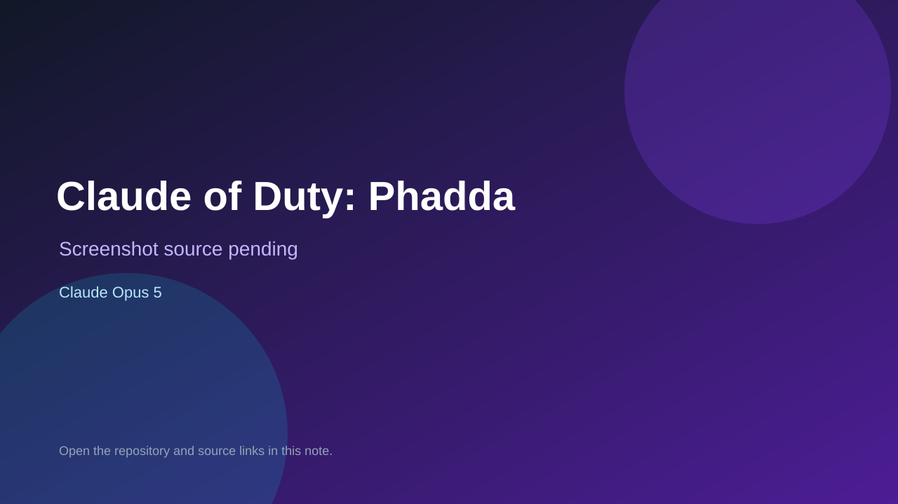

# Claude of Duty: Phadda

> Verified game note.

## At a glance

- **Score:** 7.5/10
- **Model:** Claude Opus 5
- **Technology:** Three.js, Rapier, JavaScript, WebGL
- **Verified:** 2026-09-09
- **Repository:** [https://github.com/zainzafar90/call-of-duty-phadda](https://github.com/zainzafar90/call-of-duty-phadda)
- **Evidence:** [direct model evidence](https://github.com/zainzafar90/call-of-duty-phadda)

## Screenshots

No screenshot source is recorded yet. Keep the placeholder until a repository, awesome list, or creator source provides an image.

## Model attribution

Open the evidence link above. Evidence grade: **direct model evidence**.

## Source description

The SomethingBig games directory reports this game. The README describes a Claude-built Three.js and Rapier browser FPS, and the source tree contains player, weapon, AI, physics, HUD, world, and critic-loop modules plus a public deployment.

### Gameplay source

- [https://github.com/zainzafar90/call-of-duty-phadda](https://github.com/zainzafar90/call-of-duty-phadda)

## Verification notes

- **Status:** verified
- **Counted units:** 1
- **Discovery:** https://somethingbig.ai/games; https://github.com/zainzafar90/call-of-duty-phadda

[Back to the awesome list](../../README.md)
