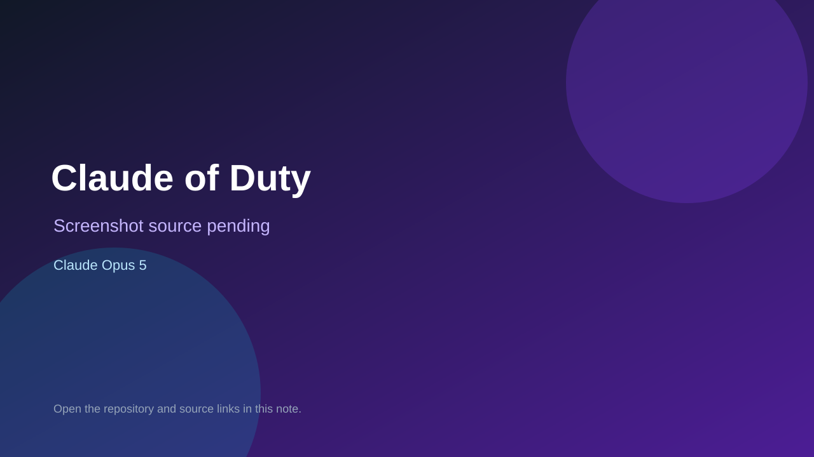

# Claude of Duty

> Verified game note.

## At a glance

- **Score:** 7.5/10
- **Model:** Claude Opus 5
- **Technology:** Three.js, TypeScript, Web Audio API
- **Verified:** 2026-09-09
- **Repository:** [https://github.com/brynary/claude-of-duty](https://github.com/brynary/claude-of-duty)
- **Evidence:** [creator-reported model evidence](https://github.com/brynary/claude-of-duty)

## Screenshots

No screenshot source is recorded yet. Keep the placeholder until a repository, awesome list, or creator source provides an image.

## Model attribution

Open the evidence link above. Evidence grade: **creator-reported model evidence**.

## Source description

The SomethingBig games directory reports this as a Gauntlet Loop game. The README specifies a runnable Three.js FPS, controls, enemies, waves, and deterministic AI game runs.

### Gameplay source

- [https://github.com/brynary/claude-of-duty](https://github.com/brynary/claude-of-duty)

## Verification notes

- **Status:** verified
- **Counted units:** 1
- **Discovery:** https://somethingbig.ai/games; https://github.com/brynary/claude-of-duty

[Back to the awesome list](../../README.md)
