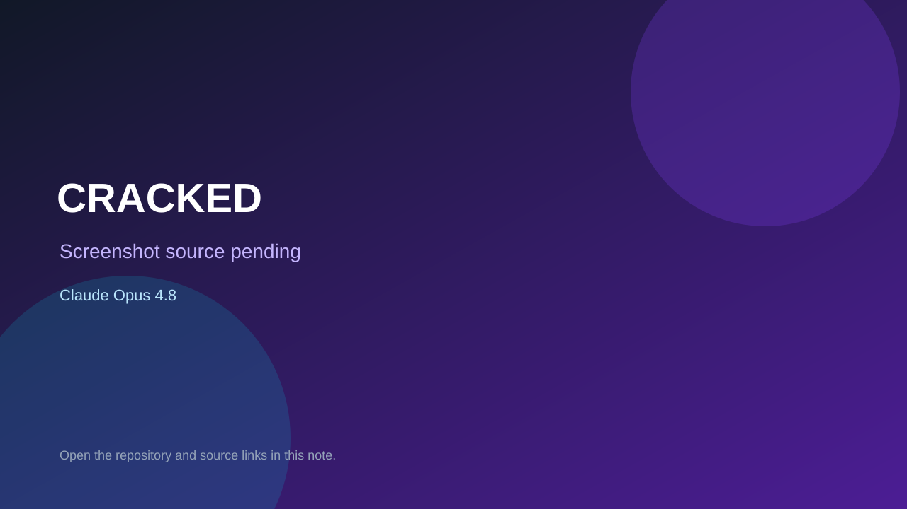

# CRACKED

> Verified game note.

## At a glance

- **Score:** 8.1/10
- **Model:** Claude Opus 4.8
- **Technology:** MonoGame, .NET, C#, Native desktop
- **Verified:** 2026-09-10
- **Repository:** [https://github.com/duke1937/Cracked](https://github.com/duke1937/Cracked)
- **Evidence:** [direct model evidence](https://github.com/duke1937/Cracked/commit/d9e87bbaa98f7b2771e9baef002fef1374ed73b)

## Screenshots

No screenshot source is recorded yet. Keep the placeholder until a repository, awesome list, or creator source provides an image.

## Model attribution

Open the evidence link above. Evidence grade: **direct model evidence**.

## Source description

The cited commit describes a self-contained endless egg-money game with egg purchases, conveyor movement, hatching and passive chicken income. Source includes game, world, entities, egg types, layout and graphics. The commit page shows a direct Claude Opus 4.8 trailer.

### Gameplay source

- [https://github.com/duke1937/Cracked/blob/main/CrackedGame.cs](https://github.com/duke1937/Cracked/blob/main/CrackedGame.cs)
- [https://github.com/duke1937/Cracked/blob/main/Game/World.cs](https://github.com/duke1937/Cracked/blob/main/Game/World.cs)
- [https://github.com/duke1937/Cracked/blob/main/Game/Entities.cs](https://github.com/duke1937/Cracked/blob/main/Game/Entities.cs)
- [https://github.com/duke1937/Cracked/commit/d9e87bbaa98f7b2771e9baef002fef1374ed73b](https://github.com/duke1937/Cracked/commit/d9e87bbaa98f7b2771e9baef002fef1374ed73b)

## Verification notes

- **Status:** verified_source
- **Counted units:** 1
- **Discovery:** GitHub commit search for MonoGame game Co-Authored-By Claude Opus; https://github.com/duke1937/Cracked

[Back to the awesome list](../../README.md)
