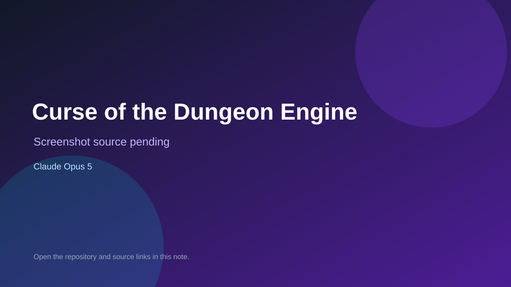

# Curse of the Dungeon Engine

> Verified game note.

## At a glance

- **Score:** 9.3/10
- **Model:** Claude Opus 5
- **Technology:** C++17, SDL2, Custom C++ engine, Native desktop, Nintendo Switch, First-person dungeon crawler
- **Verified:** 2026-09-10
- **Repository:** [https://github.com/edrethardo/game](https://github.com/edrethardo/game)
- **Evidence:** [direct model evidence](https://github.com/edrethardo/game/commit/8148119d359e264f39f0c1d047389c3830c38fc1)

## Screenshots

No screenshot source is recorded yet. Keep the placeholder until a repository, awesome list, or creator source provides an image.

## Model attribution

Open the evidence link above. Evidence grade: **direct model evidence**.

## Source description

The README and source describe a native first-person dungeon crawler with eight classes, real-time combat, loot and skills, procedural dungeons, tactical enemy AI, local split-screen, online multiplayer, SDL2 build instructions, and Nintendo Switch deployment. The repository contains substantial engine, game, world, network, render, asset and test code. The inspected history has exact Claude Opus 5 trailers on arena gameplay, combat, classes, maps and trailer gameplay. Count it once as an independent native game.

### Gameplay source

- [https://github.com/edrethardo/game/blob/master/README.md](https://github.com/edrethardo/game/blob/master/README.md)
- [https://github.com/edrethardo/game/tree/master/src/game](https://github.com/edrethardo/game/tree/master/src/game)
- [https://github.com/edrethardo/game/tree/master/src/world](https://github.com/edrethardo/game/tree/master/src/world)
- [https://github.com/edrethardo/game/blob/master/src/engine/engine.cpp](https://github.com/edrethardo/game/blob/master/src/engine/engine.cpp)
- [https://github.com/edrethardo/game/tree/master/tests/game](https://github.com/edrethardo/game/tree/master/tests/game)
- [https://github.com/edrethardo/game/commit/8148119d359e264f39f0c1d047389c3830c38fc1](https://github.com/edrethardo/game/commit/8148119d359e264f39f0c1d047389c3830c38fc1)

## Verification notes

- **Status:** verified_source
- **Counted units:** 1
- **Discovery:** GitHub code search for SDL game Co-Authored-By Claude Opus; https://github.com/edrethardo/game

[Back to the awesome list](../../README.md)
