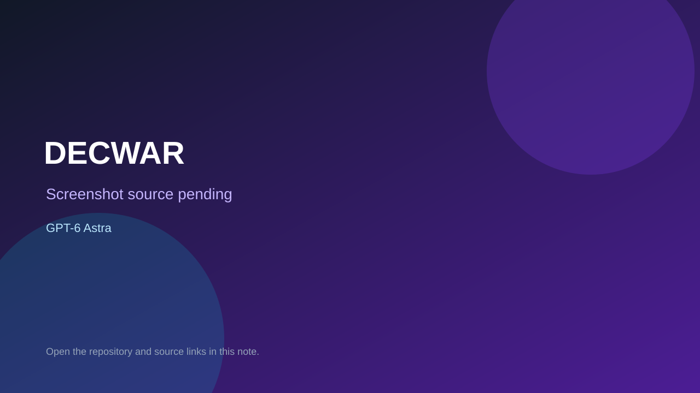

# DECWAR

> Verified game note.

## At a glance

- **Score:** 8.7/10
- **Model:** GPT-6 Astra
- **Technology:** TypeScript, Node.js, TCP/Telnet, Terminal, Native server
- **Verified:** 2026-09-10
- **Repository:** [https://github.com/erictfree/DECWAR](https://github.com/erictfree/DECWAR)
- **Evidence:** [direct model evidence](https://github.com/erictfree/DECWAR#status-playable-alpha)

## Screenshots

No screenshot source is recorded yet. Keep the placeholder until a repository, awesome list, or creator source provides an image.

## Model attribution

Open the evidence link above. Evidence grade: **direct model evidence**.

## Source description

The README explicitly credits OpenAI GPT-6 Astra and describes a playable multiplayer space-battle game ported to TypeScript. The game has shared real-time galaxies, Federation/Empire ships, scanning, navigation, phasers, torpedoes, planet capture, construction, messaging, scoring and a Romulan opponent. The repository contains the Node.js/Telnet runtime, preserved source provenance, two game variants, persistence and automated multiplayer Telnet tests. It has no browser build; classify it under Non-Browser Engines as a native terminal/server game.

### Gameplay source

- [https://github.com/erictfree/DECWAR#status-playable-alpha](https://github.com/erictfree/DECWAR#status-playable-alpha)

## Verification notes

- **Status:** verified
- **Counted units:** 1
- **Discovery:** https://github.com/erictfree/DECWAR; https://api.github.com/search/repositories?q=%22GPT-6+Astra%22+game+in%3Areadme+pushed%3A2026-09-09..2026-09-09

[Back to the awesome list](../../README.md)
