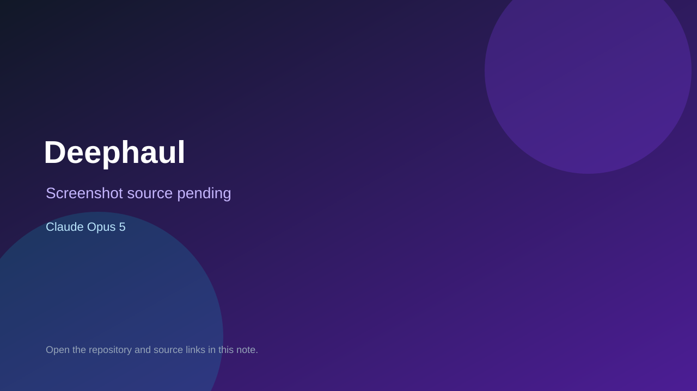

# Deephaul

> Verified game note.

## At a glance

- **Score:** 7.0/10
- **Model:** Claude Opus 5
- **Technology:** Three.js, TypeScript, Node.js, WebRTC
- **Verified:** 2026-09-09
- **Repository:** [https://github.com/TESTYEE-09/Deephaul-opus5-](https://github.com/TESTYEE-09/Deephaul-opus5-)
- **Evidence:** [repository-topic model evidence](https://github.com/TESTYEE-09/Deephaul-opus5-)

## Screenshots

No screenshot source is recorded yet. Keep the placeholder until a repository, awesome list, or creator source provides an image.

## Model attribution

Open the evidence link above. Evidence grade: **repository-topic model evidence**.

## Source description

Playable cooperative first-person scavenging game with seven moons, creatures, quota loop, browser deployment, tests, and Opus 5 in the repository identity.

### Gameplay source

- [https://github.com/TESTYEE-09/Deephaul-opus5-](https://github.com/TESTYEE-09/Deephaul-opus5-)

## Verification notes

- **Status:** verified
- **Counted units:** 1
- **Discovery:** https://github.com/TESTYEE-09/Deephaul-opus5-

[Back to the awesome list](../../README.md)
