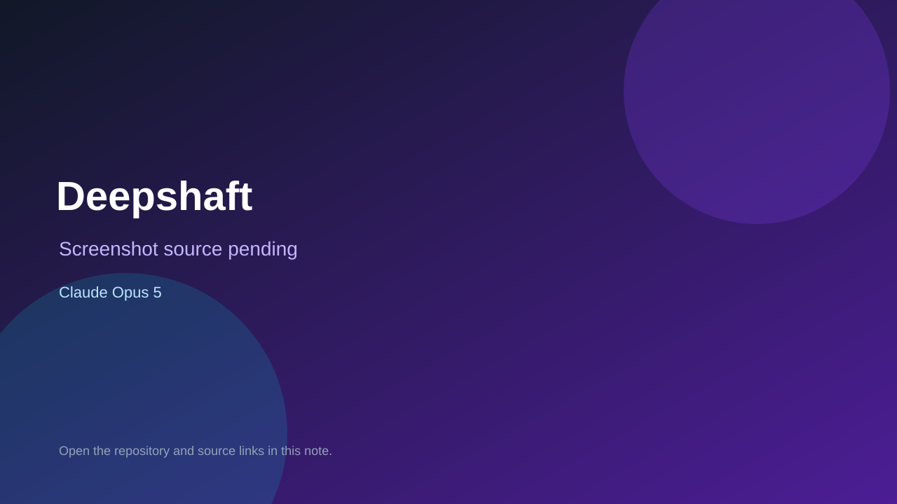

# Deepshaft

> Verified game note.

## At a glance

- **Score:** 9.5/10
- **Model:** Claude Opus 5
- **Technology:** TypeScript, Vite, Canvas 2D raycaster, WebRTC, Trystero, Procedural audio, Browser multiplayer
- **Verified:** 2026-09-10
- **Repository:** [https://github.com/ben-gy/deepshaft](https://github.com/ben-gy/deepshaft)
- **Evidence:** [direct model evidence](https://github.com/ben-gy/deepshaft/commit/51e8cdce6bb91b7c8a23f2e92a4aec28846a10b7)
- **Live demo:** [open demo](https://deepshaft.benrichardson.dev)

## Screenshots

No screenshot source is recorded yet. Keep the placeholder until a repository, awesome list, or creator source provides an image.

## Model attribution

Open the evidence link above. Evidence grade: **direct model evidence**.

## Source description

The README documents Deepshaft as a playable first-person raycast crawl through a procedural mine. It has Stope, Adit and Lode run modes, movement and turning, weapons, ammo, doors, firedamp, grates, sumps, rescue of downed co-op players, tutorial, deterministic fixed-step simulation, live 2–4 player WebRTC co-op, procedural rendering/audio, GitHub Pages hosting and 392 tests. The cited HUD/rendering commit fixes player-facing hit targets, wall projection and co-op seat colors and contains an exact Co-Authored-By: Claude Opus 5 trailer. Count the current first-person mine game once; exclude shared engine features and the factory index.

### Gameplay source

- [https://github.com/ben-gy/deepshaft#readme](https://github.com/ben-gy/deepshaft#readme)
- [https://deepshaft.benrichardson.dev](https://deepshaft.benrichardson.dev)
- [https://github.com/ben-gy/deepshaft/blob/main/src/main.ts](https://github.com/ben-gy/deepshaft/blob/main/src/main.ts)
- [https://github.com/ben-gy/deepshaft/blob/main/src/render.ts](https://github.com/ben-gy/deepshaft/blob/main/src/render.ts)
- [https://github.com/ben-gy/deepshaft/tree/main/src/engine](https://github.com/ben-gy/deepshaft/tree/main/src/engine)
- [https://github.com/ben-gy/deepshaft/tree/main/tests](https://github.com/ben-gy/deepshaft/tree/main/tests)
- [https://github.com/ben-gy/deepshaft/commit/51e8cdce6bb91b7c8a23f2e92a4aec28846a10b7](https://github.com/ben-gy/deepshaft/commit/51e8cdce6bb91b7c8a23f2e92a4aec28846a10b7)

## Verification notes

- **Status:** verified_source
- **Counted units:** 1
- **Discovery:** Reverse-link from ben-gy/gh-game-factory index; GitHub commit search for Co-Authored-By Claude Opus game; https://github.com/ben-gy/deepshaft

[Back to the awesome list](../../README.md)
