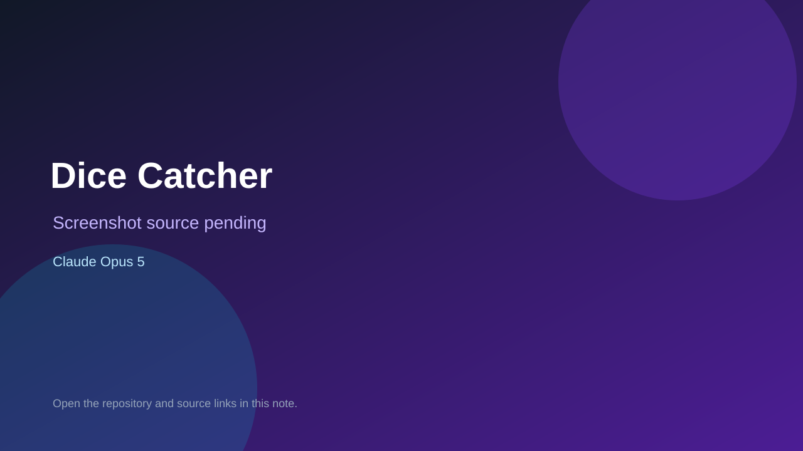

# Dice Catcher

> Verified game note.

## At a glance

- **Score:** 7.5/10
- **Model:** Claude Opus 5
- **Technology:** Godot, GDScript, Native desktop
- **Verified:** 2026-09-10
- **Repository:** [https://github.com/ArnasJuskevicius/dice-catcher](https://github.com/ArnasJuskevicius/dice-catcher)
- **Evidence:** [direct model evidence](https://github.com/ArnasJuskevicius/dice-catcher/commit/4d84d3d6d64169ba3298a13f8d3e3ffb4e0c79e7)

## Screenshots

No screenshot source is recorded yet. Keep the placeholder until a repository, awesome list, or creator source provides an image.

## Model attribution

Open the evidence link above. Evidence grade: **direct model evidence**.

## Source description

The commit describes a fox-catches-dice game and includes project.godot, game/fox/dice scenes, gameplay scripts, sprites, fonts and audio assets. The commit includes a direct Claude Opus 5 trailer.

### Gameplay source

- [https://github.com/ArnasJuskevicius/dice-catcher/blob/4d84d3d6d64169ba3298a13f8d3e3ffb4e0c79e7/project.godot](https://github.com/ArnasJuskevicius/dice-catcher/blob/4d84d3d6d64169ba3298a13f8d3e3ffb4e0c79e7/project.godot)
- [https://github.com/ArnasJuskevicius/dice-catcher/blob/4d84d3d6d64169ba3298a13f8d3e3ffb4e0c79e7/scenes/game/game.gd](https://github.com/ArnasJuskevicius/dice-catcher/blob/4d84d3d6d64169ba3298a13f8d3e3ffb4e0c79e7/scenes/game/game.gd)
- [https://github.com/ArnasJuskevicius/dice-catcher/blob/4d84d3d6d64169ba3298a13f8d3e3ffb4e0c79e7/scenes/game/game.tscn](https://github.com/ArnasJuskevicius/dice-catcher/blob/4d84d3d6d64169ba3298a13f8d3e3ffb4e0c79e7/scenes/game/game.tscn)
- [https://github.com/ArnasJuskevicius/dice-catcher/commit/4d84d3d6d64169ba3298a13f8d3e3ffb4e0c79e7](https://github.com/ArnasJuskevicius/dice-catcher/commit/4d84d3d6d64169ba3298a13f8d3e3ffb4e0c79e7)

## Verification notes

- **Status:** verified_source
- **Counted units:** 1
- **Discovery:** GitHub commit search for Godot game Co-Authored-By Claude Opus; https://github.com/ArnasJuskevicius/dice-catcher

[Back to the awesome list](../../README.md)
