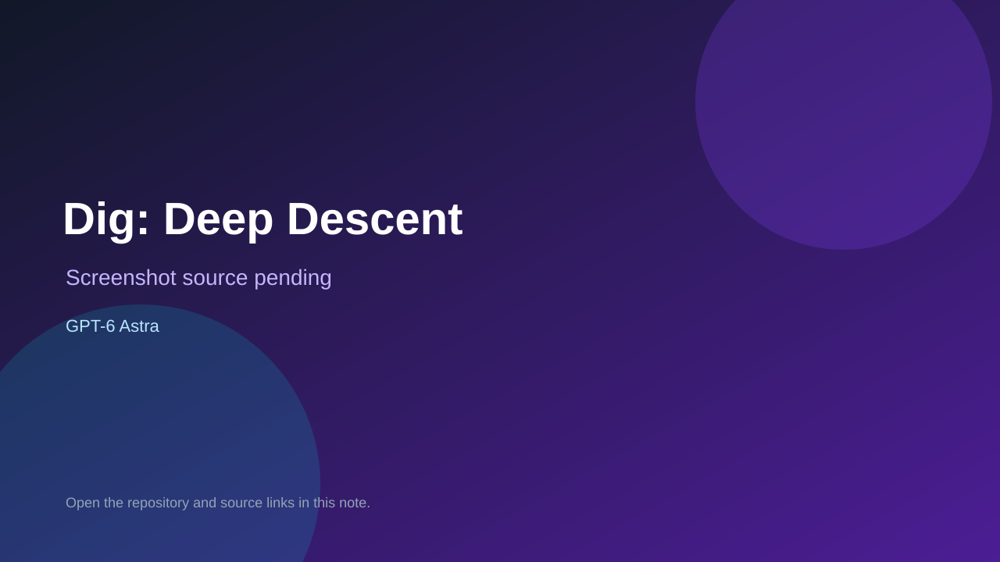

# Dig: Deep Descent

> Verified game note.

## At a glance

- **Score:** 8.1/10
- **Model:** GPT-6 Astra
- **Technology:** JavaScript, Canvas 2D, Browser
- **Verified:** 2026-09-10
- **Repository:** [https://github.com/aaronshaver/dig-deep-descent](https://github.com/aaronshaver/dig-deep-descent)
- **Evidence:** [direct model evidence](https://github.com/aaronshaver/dig-deep-descent#status-update-2026-09-05)

## Screenshots

No screenshot source is recorded yet. Keep the placeholder until a repository, awesome list, or creator source provides an image.

## Model attribution

Open the evidence link above. Evidence grade: **direct model evidence**.

## Source description

The README explicitly states that GPT-6 Astra High updated version 0.3.0 and lists new gameplay systems: orbital shop, ship upgrades, progression contracts, hazards, animated mining, permadeath, portable saves and a procedural soundtrack. The repository contains the bundled browser game, direct-file launch instructions, a public GitHub Pages deployment, mining, energy and heat management, hazards, upgrades, contracts, black boxes and tests for gameplay and offline launch.

### Gameplay source

- [https://github.com/aaronshaver/dig-deep-descent/blob/main/index.html](https://github.com/aaronshaver/dig-deep-descent/blob/main/index.html)
- [https://github.com/aaronshaver/dig-deep-descent#status-update-2026-09-05](https://github.com/aaronshaver/dig-deep-descent#status-update-2026-09-05)

## Verification notes

- **Status:** verified
- **Counted units:** 1
- **Discovery:** https://api.github.com/search/repositories?q=%22GPT-6+Astra%22+playable+game+in%3Areadme; https://github.com/aaronshaver/dig-deep-descent

[Back to the awesome list](../../README.md)
