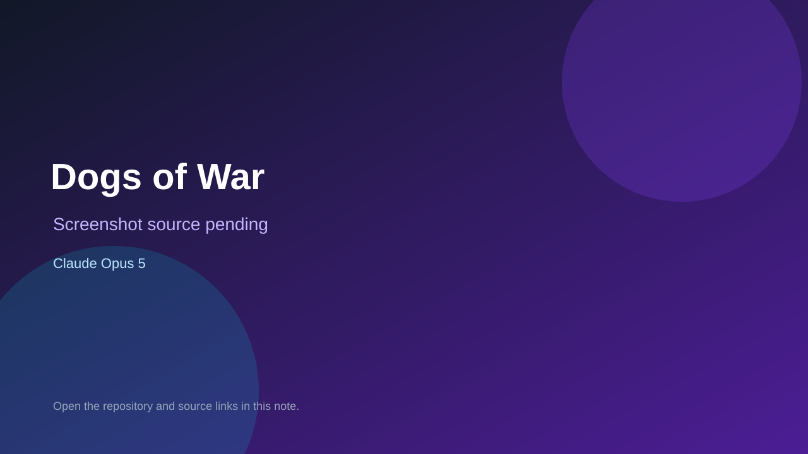

# Dogs of War

> Verified game note.

## At a glance

- **Score:** 7.0/10
- **Model:** Claude Opus 5
- **Technology:** HTML, JavaScript
- **Verified:** 2026-09-09
- **Repository:** [https://github.com/slampunk/dogs-of-war](https://github.com/slampunk/dogs-of-war)
- **Evidence:** [creator-reported model evidence](https://github.com/slampunk/dogs-of-war)

## Screenshots

No screenshot source is recorded yet. Keep the placeholder until a repository, awesome list, or creator source provides an image.

## Model attribution

Open the evidence link above. Evidence grade: **creator-reported model evidence**.

## Source description

Repository description identifies an AI-game experiment comparing Qwen and Claude Opus 5; source tree contains the browser game implementation.

### Gameplay source

- [https://github.com/slampunk/dogs-of-war](https://github.com/slampunk/dogs-of-war)

## Verification notes

- **Status:** verified
- **Counted units:** 1
- **Discovery:** https://github.com/slampunk/dogs-of-war

[Back to the awesome list](../../README.md)
