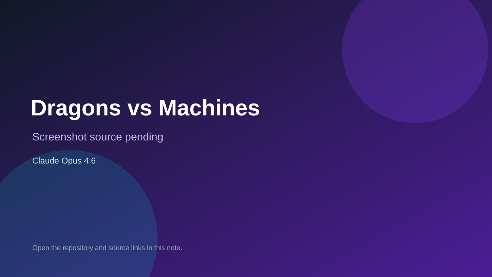

# Dragons vs Machines

> Verified game note.

## At a glance

- **Score:** 8.7/10
- **Model:** Claude Opus 4.6
- **Technology:** libGDX, Java, Box2D, Native Android/Desktop
- **Verified:** 2026-09-10
- **Repository:** [https://github.com/DavidIsaiah/dragons_vs_machines](https://github.com/DavidIsaiah/dragons_vs_machines)
- **Evidence:** [direct model evidence](https://github.com/DavidIsaiah/dragons_vs_machines/commit/dc2e7b4002baf7bf9c31c74af0e35bda3dec93fe)

## Screenshots

No screenshot source is recorded yet. Keep the placeholder until a repository, awesome list, or creator source provides an image.

## Model attribution

Open the evidence link above. Evidence grade: **direct model evidence**.

## Source description

The cited commit is titled Angry Birds-style physics game with libGDX + Box2D. It describes a complete slingshot physics game with main menu, level select, physics, entities, levels and gameplay screen, with Android, desktop, HTML and iOS launchers. The commit page shows a direct Claude Opus 4.6 trailer.

### Gameplay source

- [https://github.com/DavidIsaiah/dragons_vs_machines/tree/main/core/src/main/java/me/teamsupre/me/dragonsvsmachines](https://github.com/DavidIsaiah/dragons_vs_machines/tree/main/core/src/main/java/me/teamsupre/me/dragonsvsmachines)
- [https://github.com/DavidIsaiah/dragons_vs_machines/blob/main/core/src/main/java/me/teamsupre/me/dragonsvsmachines/screens/GameScreen.java](https://github.com/DavidIsaiah/dragons_vs_machines/blob/main/core/src/main/java/me/teamsupre/me/dragonsvsmachines/screens/GameScreen.java)
- [https://github.com/DavidIsaiah/dragons_vs_machines/commit/dc2e7b4002baf7bf9c31c74af0e35bda3dec93fe](https://github.com/DavidIsaiah/dragons_vs_machines/commit/dc2e7b4002baf7bf9c31c74af0e35bda3dec93fe)

## Verification notes

- **Status:** verified_source
- **Counted units:** 1
- **Discovery:** GitHub commit search for LibGDX game Co-Authored-By Claude Opus; https://github.com/DavidIsaiah/dragons_vs_machines

[Back to the awesome list](../../README.md)
