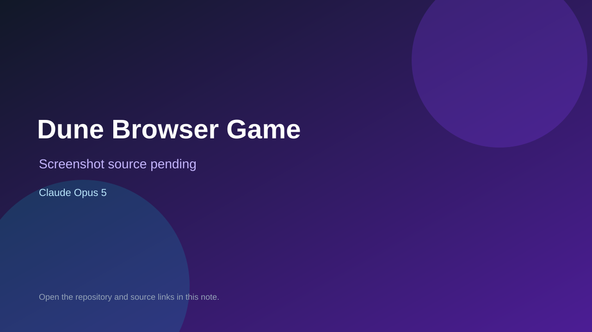

# Dune Browser Game

> Verified game note.

## At a glance

- **Score:** 6.5/10
- **Model:** Claude Opus 5
- **Technology:** Three.js, React, TypeScript, Vite
- **Verified:** 2026-09-09
- **Repository:** [https://github.com/cocodedk/Dune-Browser-Game](https://github.com/cocodedk/Dune-Browser-Game)
- **Evidence:** [directory-method model evidence](https://github.com/cocodedk/Dune-Browser-Game/blob/main/docs/PRD/game-completion/09-gauntlet-prompt.md)

## Screenshots

No screenshot source is recorded yet. Keep the placeholder until a repository, awesome list, or creator source provides an image.

## Model attribution

Open the evidence link above. Evidence grade: **directory-method model evidence**.

## Source description

Real browser strategy game with live GitHub Pages links; repo contains a game-specific Gauntlet Loop operating prompt and completion evidence.

### Gameplay source

- [https://github.com/cocodedk/Dune-Browser-Game/blob/main/docs/PRD/game-completion/09-gauntlet-prompt.md](https://github.com/cocodedk/Dune-Browser-Game/blob/main/docs/PRD/game-completion/09-gauntlet-prompt.md)

## Verification notes

- **Status:** verified
- **Counted units:** 1
- **Discovery:** https://github.com/cocodedk/Dune-Browser-Game

[Back to the awesome list](../../README.md)
