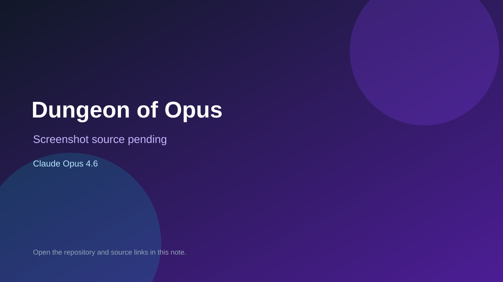

# Dungeon of Opus

> Verified game note.

## At a glance

- **Score:** 8.4/10
- **Model:** Claude Opus 4.6
- **Technology:** React, TypeScript, Tailwind CSS, Vite, Browser
- **Verified:** 2026-09-10
- **Repository:** [https://github.com/joozio/dungeon-of-opus](https://github.com/joozio/dungeon-of-opus)
- **Evidence:** [direct model evidence](https://github.com/joozio/dungeon-of-opus#features)

## Screenshots

No screenshot source is recorded yet. Keep the placeholder until a repository, awesome list, or creator source provides an image.

## Model attribution

Open the evidence link above. Evidence grade: **direct model evidence**.

## Source description

The README explicitly says Claude Opus 4.6 built the complete roguelike in one file. It documents procedural dungeons, turn-based combat, seven enemy types, inventory, fog of war, multiple floors, permadeath and a final boss. The repository contains the React/TypeScript source, local Vite launch instructions and a public live demo. The game is source-backed and directly attributed, not a prompt-only catalog entry.

### Gameplay source

- [https://github.com/joozio/dungeon-of-opus/tree/main/src](https://github.com/joozio/dungeon-of-opus/tree/main/src)
- [https://github.com/joozio/dungeon-of-opus#features](https://github.com/joozio/dungeon-of-opus#features)

## Verification notes

- **Status:** verified
- **Counted units:** 1
- **Discovery:** https://api.github.com/search/repositories?q=%22Claude+Opus+4.6%22+playable+game+in%3Areadme; https://github.com/joozio/dungeon-of-opus

[Back to the awesome list](../../README.md)
