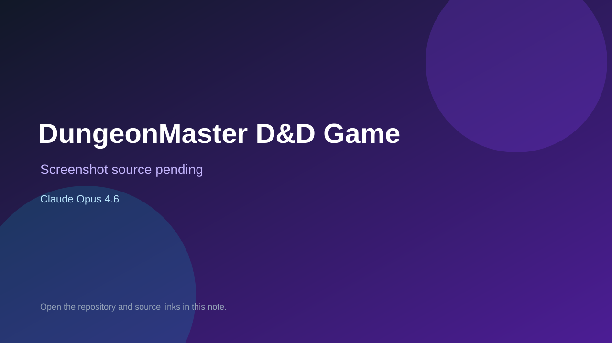

# DungeonMaster D&D Game

> Verified game note.

## At a glance

- **Score:** 7.8/10
- **Model:** Claude Opus 4.6
- **Technology:** PHP, Laravel, Laravel AI SDK, Browser
- **Verified:** 2026-09-10
- **Repository:** [https://github.com/SethSharp/codeverse](https://github.com/SethSharp/codeverse)
- **Evidence:** [direct model evidence](https://github.com/SethSharp/codeverse/commit/15d034371a8cbe2b76a82d3905349335051e9d70)

## Screenshots

No screenshot source is recorded yet. Keep the placeholder until a repository, awesome list, or creator source provides an image.

## Model attribution

Open the evidence link above. Evidence grade: **direct model evidence**.

## Source description

The README describes a D&D-style game powered by an AI Dungeon Master. The cited commit adds a DungeonMaster agent, GameSession model, persistent conversation memory, health, energy, inventory, encounter tracking, game routes and start/action endpoints, with direct Claude Opus 4.6 trailers. Count it as a server-backed interactive game source.

### Gameplay source

- [https://github.com/SethSharp/codeverse/tree/main/app/Http/Controllers/GameController.php](https://github.com/SethSharp/codeverse/tree/main/app/Http/Controllers/GameController.php)
- [https://github.com/SethSharp/codeverse/commit/15d034371a8cbe2b76a82d3905349335051e9d70](https://github.com/SethSharp/codeverse/commit/15d034371a8cbe2b76a82d3905349335051e9d70)

## Verification notes

- **Status:** verified_source
- **Counted units:** 1
- **Discovery:** GitHub commit search for game Co-Authored-By Claude Opus 4.6; https://github.com/SethSharp/codeverse

[Back to the awesome list](../../README.md)
