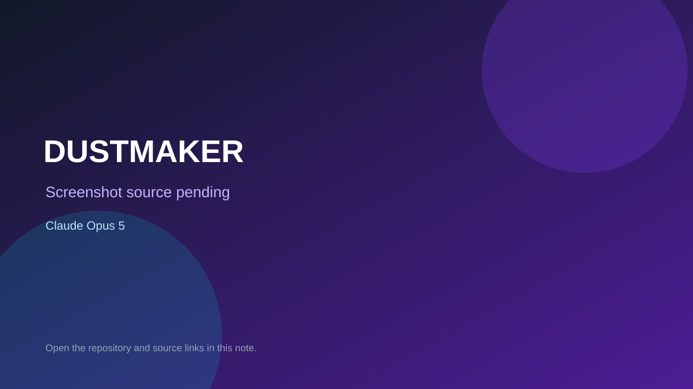

# DUSTMAKER

> Verified game note.

## At a glance

- **Score:** 7.0/10
- **Model:** Claude Opus 5
- **Technology:** HTML, JavaScript, Canvas
- **Verified:** 2026-09-09
- **Repository:** [https://github.com/eriknomitch/dustmaker](https://github.com/eriknomitch/dustmaker)
- **Evidence:** [directory-method model evidence](https://github.com/eriknomitch/dustmaker/blob/main/prompt.md)

## Screenshots

No screenshot source is recorded yet. Keep the placeholder until a repository, awesome list, or creator source provides an image.

## Model attribution

Open the evidence link above. Evidence grade: **directory-method model evidence**.

## Source description

Playable browser game and prototype; prompt.md is the Gauntlet Loop prompt used to build the repository.

### Gameplay source

- [https://github.com/eriknomitch/dustmaker/blob/main/prompt.md](https://github.com/eriknomitch/dustmaker/blob/main/prompt.md)

## Verification notes

- **Status:** verified
- **Counted units:** 1
- **Discovery:** https://github.com/eriknomitch/dustmaker

[Back to the awesome list](../../README.md)
