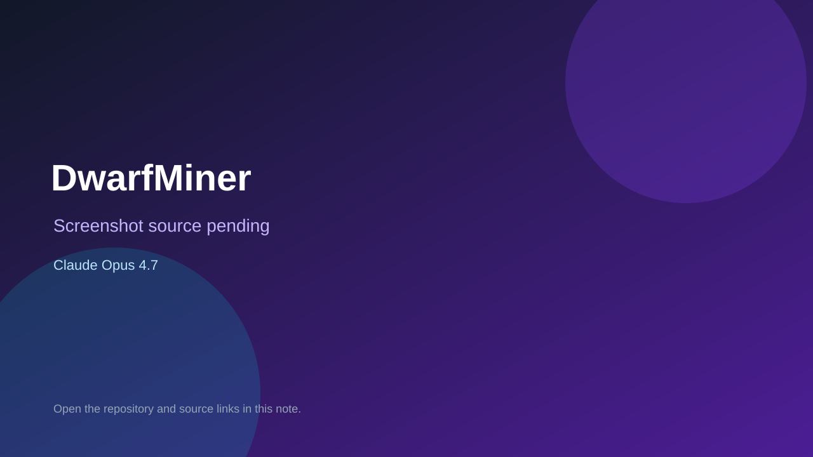

# DwarfMiner

> Verified game note.

## At a glance

- **Score:** 8.8/10
- **Model:** Claude Opus 4.7
- **Technology:** MonoGame, C#, Native desktop
- **Verified:** 2026-09-10
- **Repository:** [https://github.com/dainedwards/DwarfMiner](https://github.com/dainedwards/DwarfMiner)
- **Evidence:** [direct model evidence](https://github.com/dainedwards/DwarfMiner/commit/e85ac99df950bb56df8f58584fffb70d72a4b5fd)

## Screenshots

No screenshot source is recorded yet. Keep the placeholder until a repository, awesome list, or creator source provides an image.

## Model attribution

Open the evidence link above. Evidence grade: **direct model evidence**.

## Source description

The cited commit describes a procedural pixel-rendered mining game with a polar tile planet, dwarf player, titan boss, ore/biome world generation and crafting. Source includes player, creature, projectile, titan, renderer, lighting, particles, crafting, save, physics, planet, tiles and world generation. The commit page shows a direct Claude Opus 4.7 trailer.

### Gameplay source

- [https://github.com/dainedwards/DwarfMiner/blob/main/Game1.cs](https://github.com/dainedwards/DwarfMiner/blob/main/Game1.cs)
- [https://github.com/dainedwards/DwarfMiner/tree/main/src/Entities](https://github.com/dainedwards/DwarfMiner/tree/main/src/Entities)
- [https://github.com/dainedwards/DwarfMiner/tree/main/src/World](https://github.com/dainedwards/DwarfMiner/tree/main/src/World)
- [https://github.com/dainedwards/DwarfMiner/commit/e85ac99df950bb56df8f58584fffb70d72a4b5fd](https://github.com/dainedwards/DwarfMiner/commit/e85ac99df950bb56df8f58584fffb70d72a4b5fd)

## Verification notes

- **Status:** verified_source
- **Counted units:** 1
- **Discovery:** GitHub commit search for MonoGame game Co-Authored-By Claude Opus; https://github.com/dainedwards/DwarfMiner

[Back to the awesome list](../../README.md)
