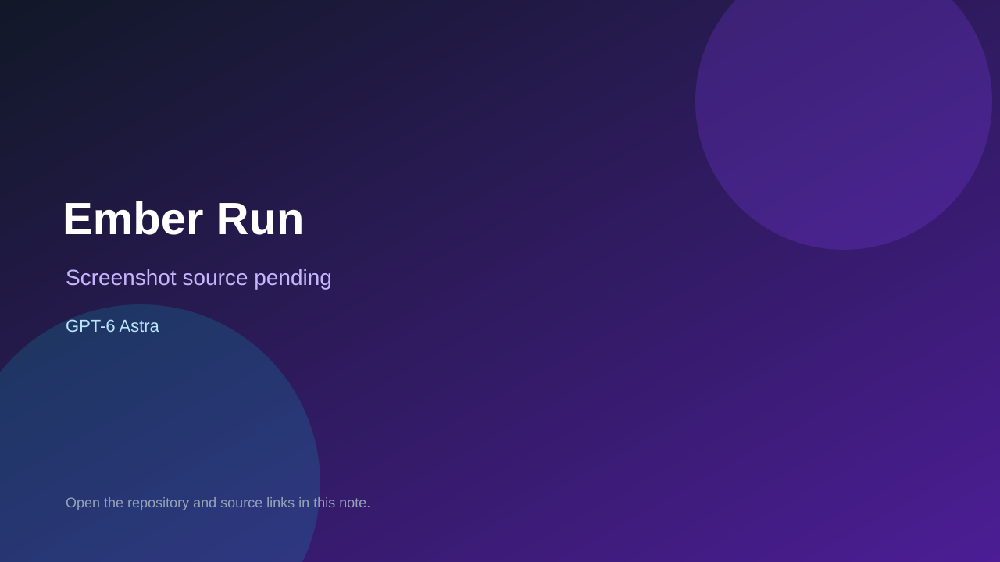

# Ember Run

> Verified game note.

## At a glance

- **Score:** 7.5/10
- **Model:** GPT-6 Astra
- **Technology:** Phaser 3, JavaScript, HTML Canvas, Web Audio API
- **Verified:** 2026-09-09
- **Repository:** [https://github.com/mbilalameen/games.ai](https://github.com/mbilalameen/games.ai)
- **Evidence:** [creator-reported model evidence](https://github.com/mbilalameen/games.ai/blob/main/index.html)

## Screenshots

No screenshot source is recorded yet. Keep the placeholder until a repository, awesome list, or creator source provides an image.

## Model attribution

Open the evidence link above. Evidence grade: **creator-reported model evidence**.

## Source description

Repository was created today with a description naming GPT Astra and contains a complete Phaser game in index.html: jumping, firing, enemies, power-ups, scoring, pause, mute, collision state, and game-over behavior.

### Gameplay source

- [https://github.com/mbilalameen/games.ai/blob/main/index.html](https://github.com/mbilalameen/games.ai/blob/main/index.html)

## Verification notes

- **Status:** verified
- **Counted units:** 1
- **Discovery:** https://github.com/mbilalameen/games.ai

[Back to the awesome list](../../README.md)
