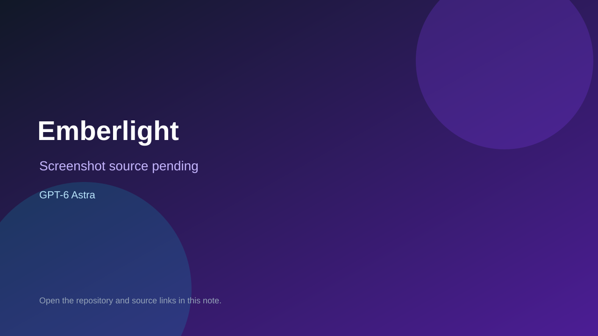

# Emberlight

> Verified game note.

## At a glance

- **Score:** 8.5/10
- **Model:** GPT-6 Astra
- **Technology:** Three.js, JavaScript, WebGL, Blender, Web Audio API, GitHub Pages
- **Verified:** 2026-09-09
- **Repository:** [https://github.com/LeiGaoRobot/emberlight](https://github.com/LeiGaoRobot/emberlight)
- **Evidence:** [creator-reported model evidence](https://github.com/LeiGaoRobot/emberlight/blob/main/README.md)

## Screenshots

No screenshot source is recorded yet. Keep the placeholder until a repository, awesome list, or creator source provides an image.

## Model attribution

Open the evidence link above. Evidence grade: **creator-reported model evidence**.

## Source description

README documents a playable survivors-like with a public GitHub Pages build, Three.js runtime, procedurally generated world, combat, weather, weapons, talents, bosses, controls, offline build, debug simulation hooks, and an eight-to-ten-minute survival simulation. It explicitly attributes the project to GPT-6 Astra + Blender + Godot; the shipped runtime is Three.js, so it belongs in the browser category.

### Gameplay source

- [https://github.com/LeiGaoRobot/emberlight/blob/main/README.md](https://github.com/LeiGaoRobot/emberlight/blob/main/README.md)

## Verification notes

- **Status:** verified
- **Counted units:** 1
- **Discovery:** https://github.com/LeiGaoRobot/emberlight; https://x.com/op7418/status/2096949703829295484

[Back to the awesome list](../../README.md)
