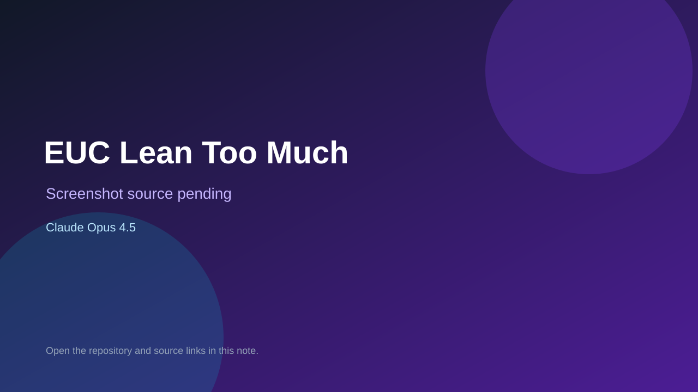

# EUC Lean Too Much

> Verified game note.

## At a glance

- **Score:** 8.4/10
- **Model:** Claude Opus 4.5
- **Technology:** libGDX, Kotlin, Box2D-style physics, Native Android/Desktop
- **Verified:** 2026-09-10
- **Repository:** [https://github.com/crcknaka/euc-lean-too-much](https://github.com/crcknaka/euc-lean-too-much)
- **Evidence:** [direct model evidence](https://github.com/crcknaka/euc-lean-too-much/commit/2dae5ec9e80a0cd506fba2b8cd9802c90e933b78)

## Screenshots

No screenshot source is recorded yet. Keep the placeholder until a repository, awesome list, or creator source provides an image.

## Model attribution

Open the evidence link above. Evidence grade: **direct model evidence**.

## Source description

The initial commit is titled EUC Lean Too Much game and describes a LibGDX Kotlin game for Android and desktop. Source includes player/car/pedestrian entities, movement and collision systems, physics, AI, procedural world generation, camera, game session/state, high scores, HUD, menu and game-over rendering. The commit page shows a direct Claude Opus 4.5 trailer.

### Gameplay source

- [https://github.com/crcknaka/euc-lean-too-much/tree/main/core/src/main/kotlin/com/eucleantoomuch/game](https://github.com/crcknaka/euc-lean-too-much/tree/main/core/src/main/kotlin/com/eucleantoomuch/game)
- [https://github.com/crcknaka/euc-lean-too-much/blob/main/core/src/main/kotlin/com/eucleantoomuch/game/EucGame.kt](https://github.com/crcknaka/euc-lean-too-much/blob/main/core/src/main/kotlin/com/eucleantoomuch/game/EucGame.kt)
- [https://github.com/crcknaka/euc-lean-too-much/commit/2dae5ec9e80a0cd506fba2b8cd9802c90e933b78](https://github.com/crcknaka/euc-lean-too-much/commit/2dae5ec9e80a0cd506fba2b8cd9802c90e933b78)

## Verification notes

- **Status:** verified_source
- **Counted units:** 1
- **Discovery:** GitHub commit search for LibGDX game Co-Authored-By Claude Opus; https://github.com/crcknaka/euc-lean-too-much

[Back to the awesome list](../../README.md)
