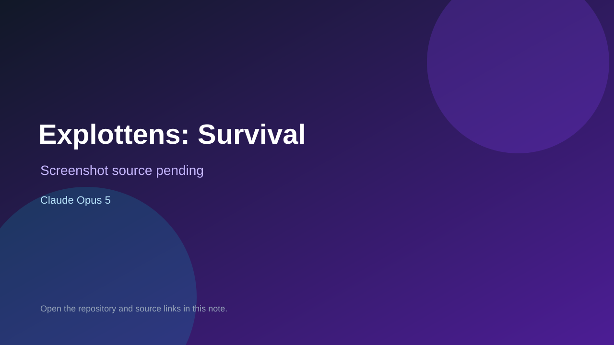

# Explottens: Survival

> Top-list entry: **today** (#9).

## At a glance

- **Score:** 9.2/10
- **Model:** Claude Opus 5
- **Technology:** TypeScript, Phaser 3, Canvas2D, Playable ad, Browser
- **Verified:** 2026-09-12
- **Repository:** [https://github.com/Werplay/playable-explottens-survivor](https://github.com/Werplay/playable-explottens-survivor)
- **Evidence:** [direct model evidence](https://github.com/Werplay/playable-explottens-survivor/commit/eb0183f356fc23283704b5f0d1d2882838a02155)

## Screenshots

No screenshot source is recorded yet. Keep the placeholder until a repository, awesome list, or creator source provides an image.

## Model attribution

Open the evidence link above. Evidence grade: **direct model evidence**.

## Source description

The README documents a self-contained Phaser 3 playable ad with drag movement, automatic firing, timed enemy waves, XP gems, level-up choices, mini-boss and boss, HUD, win/death states and a store end card. GameScene.ts implements movement, waves, weapons, pickups and progression; Hud.ts implements health, XP, level-up and end-card state; data.ts contains the game tables. The repository includes an exact Co-Authored-By: Claude Opus 5 trailer on player-facing gameplay commits. Count the playable-ad experience as one game; the Unity source it recreates is not counted separately.

### Gameplay source

- [https://github.com/Werplay/playable-explottens-survivor#readme](https://github.com/Werplay/playable-explottens-survivor#readme)
- [https://github.com/Werplay/playable-explottens-survivor/blob/master/src/GameScene.ts](https://github.com/Werplay/playable-explottens-survivor/blob/master/src/GameScene.ts)
- [https://github.com/Werplay/playable-explottens-survivor/blob/master/src/Hud.ts](https://github.com/Werplay/playable-explottens-survivor/blob/master/src/Hud.ts)
- [https://github.com/Werplay/playable-explottens-survivor/blob/master/src/data.ts](https://github.com/Werplay/playable-explottens-survivor/blob/master/src/data.ts)
- [https://github.com/Werplay/playable-explottens-survivor/commit/eb0183f356fc23283704b5f0d1d2882838a02155](https://github.com/Werplay/playable-explottens-survivor/commit/eb0183f356fc23283704b5f0d1d2882838a02155)

## Verification notes

- **Status:** verified_source
- **Counted units:** 1
- **Discovery:** GitHub commit search for game Co-Authored-By Claude Opus, 2026-09-10..2026-09-12; https://github.com/Werplay/playable-explottens-survivor

[Back to the awesome list](../../README.md)
