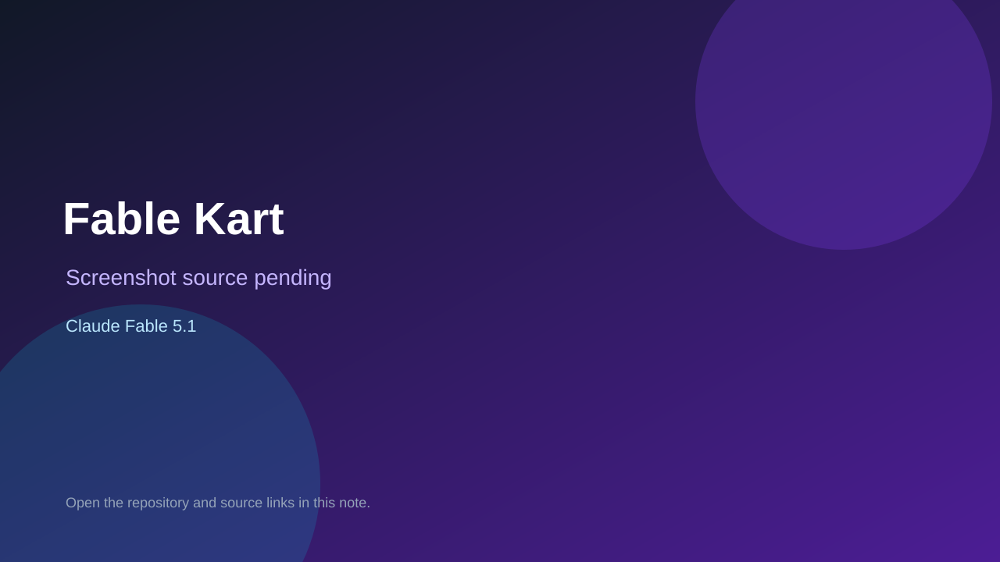

# Fable Kart

> Verified game note.

## At a glance

- **Score:** 8.5/10
- **Model:** Claude Fable 5.1
- **Technology:** Three.js, Vite, JavaScript
- **Verified:** 2026-09-09
- **Repository:** [https://github.com/koviq4/fable-sandbox](https://github.com/koviq4/fable-sandbox)
- **Evidence:** [direct model evidence](https://github.com/koviq4/fable-sandbox)

## Screenshots

No screenshot source is recorded yet. Keep the placeholder until a repository, awesome list, or creator source provides an image.

## Model attribution

Open the evidence link above. Evidence grade: **direct model evidence**.

## Source description

Three playable Three.js/Vite browser games are listed in the repository, with Fable 5.1 named in the project structure and description.

### Gameplay source

- [https://github.com/koviq4/fable-sandbox](https://github.com/koviq4/fable-sandbox)

## Verification notes

- **Status:** verified
- **Counted units:** 3
- **Discovery:** https://github.com/koviq4/fable-sandbox

[Back to the awesome list](../../README.md)
