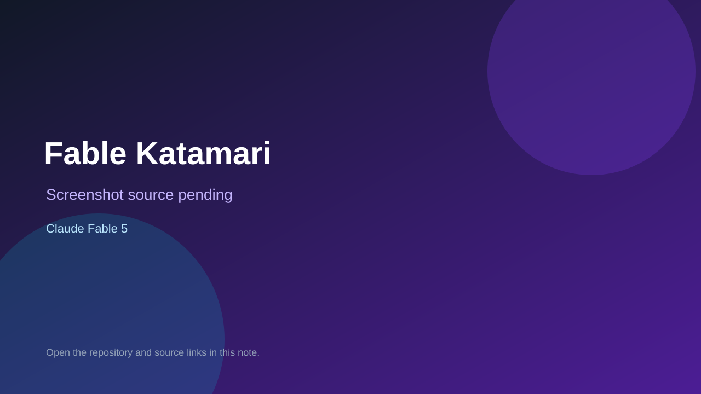

# Fable Katamari

> Verified game note.

## At a glance

- **Score:** 8.0/10
- **Model:** Claude Fable 5
- **Technology:** JavaScript, Vite, Three.js
- **Verified:** 2026-09-09
- **Repository:** [https://github.com/aieo-product/fableDemoGame](https://github.com/aieo-product/fableDemoGame)
- **Evidence:** [creator-reported model evidence](https://github.com/aieo-product/fableDemoGame/blob/main/README.md)

## Screenshots

No screenshot source is recorded yet. Keep the placeholder until a repository, awesome list, or creator source provides an image.

## Model attribution

Open the evidence link above. Evidence grade: **creator-reported model evidence**.

## Source description

README, source, docs, and live app describe a playable browser Katamari-style game with object absorption and world-scale progression; README identifies Fable 5 as the builder.

### Gameplay source

- [https://github.com/aieo-product/fableDemoGame/blob/main/README.md](https://github.com/aieo-product/fableDemoGame/blob/main/README.md)

## Verification notes

- **Status:** verified
- **Counted units:** 1
- **Discovery:** https://github.com/aieo-product/fableDemoGame

[Back to the awesome list](../../README.md)
