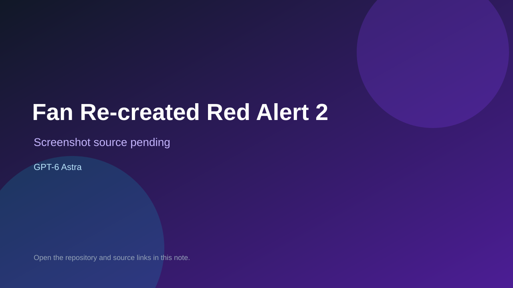

# Fan Re-created Red Alert 2

> Verified game note.

## At a glance

- **Score:** 9.0/10
- **Model:** GPT-6 Astra
- **Technology:** TypeScript, Vite, Canvas/WebGL, Web Workers, WebAssembly, Browser
- **Verified:** 2026-09-10
- **Repository:** [https://github.com/xinbenlv/ra2-gpt-6-astra-2026-09-04](https://github.com/xinbenlv/ra2-gpt-6-astra-2026-09-04)
- **Evidence:** [direct model evidence](https://github.com/xinbenlv/ra2-gpt-6-astra-2026-09-04#about-the-game)
- **Live demo:** [open demo](https://xinbenlv.github.io/ra2-gpt-6-astra-2026-09-04/)

## Screenshots

No screenshot source is recorded yet. Keep the placeholder until a repository, awesome list, or creator source provides an image.

## Model attribution

Open the evidence link above. Evidence grade: **direct model evidence**.

## Source description

The README identifies this as an independent browser RTS recreation created in a one-shot GPT-6 Astra experiment. It documents an independently written TypeScript engine, AI, rendering, interface, skirmish lobby, map editor, pathfinding, economy, combat, factions and local browser asset preparation. The repository contains substantial game-engine source, map editing, terrain rendering, worker conversion, tests, build/deploy workflows and a public GitHub Pages deployment. Browser verification opened the deployed shell and showed the live commit label; the first-run game requires a local or Internet Archive asset preparation step before the lobby becomes playable. Classified under Browser Games. Original game IP is acknowledged by the repository and is not included in the source tree.

### Gameplay source

- [https://github.com/xinbenlv/ra2-gpt-6-astra-2026-09-04#about-the-game](https://github.com/xinbenlv/ra2-gpt-6-astra-2026-09-04#about-the-game)

## Verification notes

- **Status:** verified
- **Counted units:** 1
- **Discovery:** https://github.com/xinbenlv/ra2-gpt-6-astra-2026-09-04; https://api.github.com/search/repositories?q=%22GPT-6+Astra%22+game+in%3Areadme+pushed%3A2026-09-08..2026-09-08

[Back to the awesome list](../../README.md)
