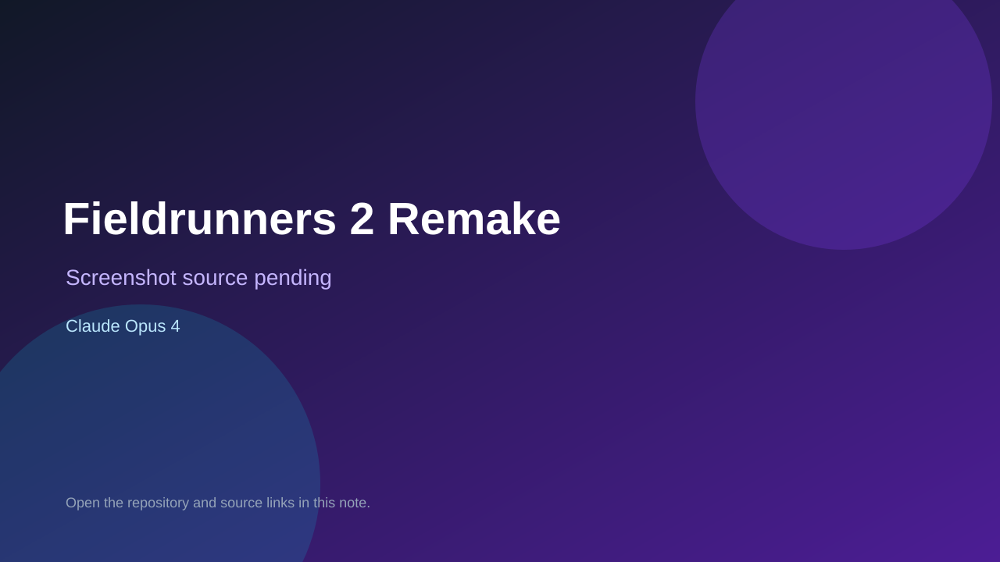

# Fieldrunners 2 Remake

> Verified game note.

## At a glance

- **Score:** 8.2/10
- **Model:** Claude Opus 4
- **Technology:** libGDX, Java, Native Android
- **Verified:** 2026-09-10
- **Repository:** [https://github.com/TanBuiDev/fieldrunners2-remake](https://github.com/TanBuiDev/fieldrunners2-remake)
- **Evidence:** [direct model evidence](https://github.com/TanBuiDev/fieldrunners2-remake/commit/4da7db1c0ee00723245ab4e4d4c9e80f80bc0ca2)

## Screenshots

No screenshot source is recorded yet. Keep the placeholder until a repository, awesome list, or creator source provides an image.

## Model attribution

Open the evidence link above. Evidence grade: **direct model evidence**.

## Source description

The cited commit is titled Fieldrunners 2 remake - libGDX 64-bit Android and describes a full game recreation. Source includes the main game, map/grid/path planner, player, wave data, gameplay screen and Android launcher. The commit page shows direct Claude Opus 4 attribution.

### Gameplay source

- [https://github.com/TanBuiDev/fieldrunners2-remake/tree/main/core/src/com/fieldrunners2](https://github.com/TanBuiDev/fieldrunners2-remake/tree/main/core/src/com/fieldrunners2)
- [https://github.com/TanBuiDev/fieldrunners2-remake/blob/main/core/src/com/fieldrunners2/game/GameplayScreen.java](https://github.com/TanBuiDev/fieldrunners2-remake/blob/main/core/src/com/fieldrunners2/game/GameplayScreen.java)
- [https://github.com/TanBuiDev/fieldrunners2-remake/commit/4da7db1c0ee00723245ab4e4d4c9e80f80bc0ca2](https://github.com/TanBuiDev/fieldrunners2-remake/commit/4da7db1c0ee00723245ab4e4d4c9e80f80bc0ca2)

## Verification notes

- **Status:** verified_source
- **Counted units:** 1
- **Discovery:** GitHub commit search for LibGDX game Co-Authored-By Claude Opus; https://github.com/TanBuiDev/fieldrunners2-remake

[Back to the awesome list](../../README.md)
