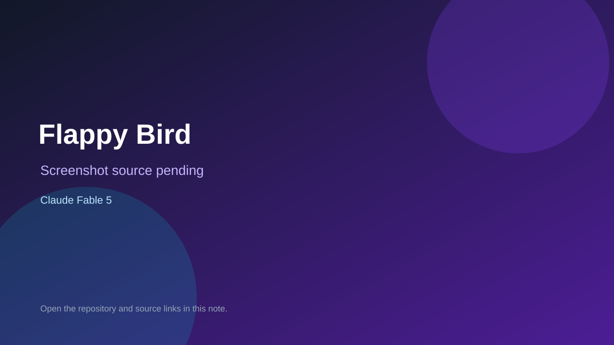

# Flappy Bird

> Verified game note.

## At a glance

- **Score:** 7.8/10
- **Model:** Claude Fable 5
- **Technology:** HTML, JavaScript, Canvas 2D, Browser
- **Verified:** 2026-09-10
- **Repository:** [https://github.com/astrosxmgkaung-ui/BhoneAlinkar](https://github.com/astrosxmgkaung-ui/BhoneAlinkar)
- **Evidence:** [direct model evidence](https://github.com/astrosxmgkaung-ui/BhoneAlinkar/commit/ac16aedacd95ddd4c32c8fecea5661e669db58d6)

## Screenshots

No screenshot source is recorded yet. Keep the placeholder until a repository, awesome list, or creator source provides an image.

## Model attribution

Open the evidence link above. Evidence grade: **direct model evidence**.

## Source description

The repository contains a complete single-file Flappy Bird game. The source implements a responsive canvas, ready/play/dead states, gravity and flap physics, procedural pipe spawning, collision detection, scoring, localStorage best score, and mouse, touch and keyboard input. The cited gameplay/deployment commit contains an exact Co-Authored-By: Claude Fable 5 trailer. The inferred GitHub Pages URL returned HTTP 404 during verification, so no live demo is claimed. Count the source game once.

### Gameplay source

- [https://github.com/astrosxmgkaung-ui/BhoneAlinkar/blob/main/index.html](https://github.com/astrosxmgkaung-ui/BhoneAlinkar/blob/main/index.html)
- [https://github.com/astrosxmgkaung-ui/BhoneAlinkar/commit/ac16aedacd95ddd4c32c8fecea5661e669db58d6](https://github.com/astrosxmgkaung-ui/BhoneAlinkar/commit/ac16aedacd95ddd4c32c8fecea5661e669db58d6)

## Verification notes

- **Status:** verified_source
- **Counted units:** 1
- **Discovery:** GitHub commit search for Co-Authored-By Claude Fable game; https://github.com/astrosxmgkaung-ui/BhoneAlinkar

[Back to the awesome list](../../README.md)
