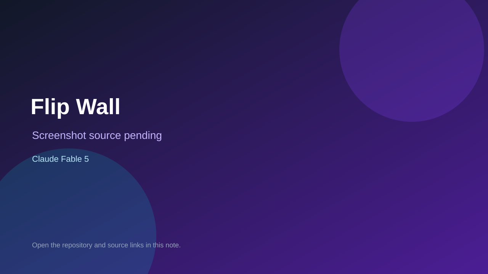

# Flip Wall

> Verified game note.

## At a glance

- **Score:** 8.5/10
- **Model:** Claude Fable 5
- **Technology:** Three.js, cannon-es, JavaScript
- **Verified:** 2026-09-09
- **Repository:** [https://github.com/shironagasu-ai/claude-fable5-3D-games](https://github.com/shironagasu-ai/claude-fable5-3D-games)
- **Evidence:** [direct model evidence](https://github.com/shironagasu-ai/claude-fable5-3D-games)

## Screenshots

No screenshot source is recorded yet. Keep the placeholder until a repository, awesome list, or creator source provides an image.

## Model attribution

Open the evidence link above. Evidence grade: **direct model evidence**.

## Source description

Repository README identifies seven browser-playable games, Three.js/cannon-es implementation, tests, and Fable-only development.

### Gameplay source

- [https://github.com/shironagasu-ai/claude-fable5-3D-games](https://github.com/shironagasu-ai/claude-fable5-3D-games)

## Verification notes

- **Status:** verified
- **Counted units:** 7
- **Discovery:** https://github.com/shironagasu-ai/claude-fable5-3D-games

[Back to the awesome list](../../README.md)
